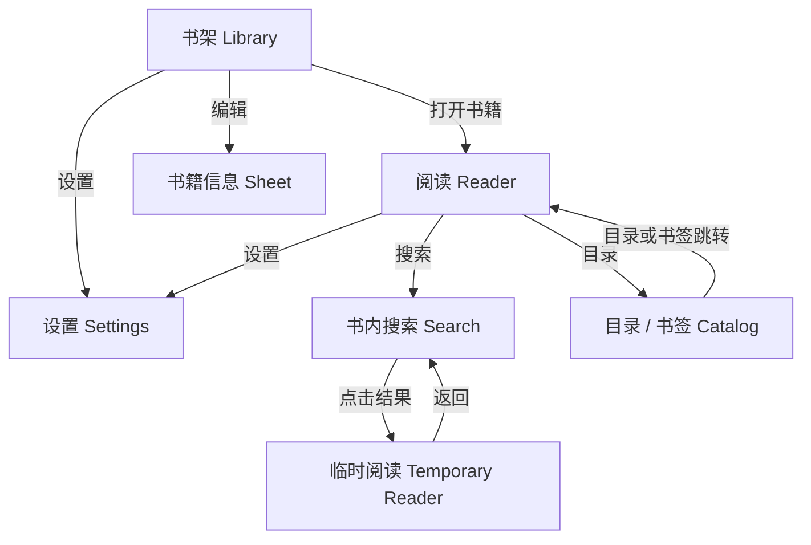
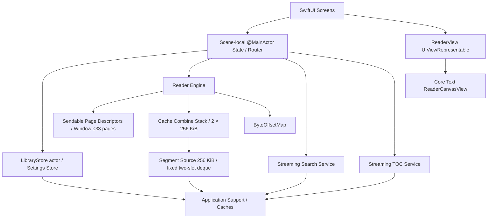

# XLib iOS 原生版开发计划

> 状态：首版已实现；阅读缓存于 2026-07-21 重构为双 Segment Combine Stack 与独立 Page Sliding Window。本文保留已审批的范围、技术路线、实施顺序和验收标准，工程位于 `apps/ios/`。

## 1. 目标与原则

为现有 XLib Android TXT 阅读器增加一个独立的原生 iOS 客户端。iOS 版保持 Android 版的核心视觉语言和功能边界，同时遵循 iOS 的导航、文件选择、手势、安全区和无障碍习惯。

核心目标：

- 功能等价：书架、阅读、搜索、目录/书签、设置均纳入首版。
- 阅读位置等价：绝对文件 byte offset 是唯一权威位置，百分比只用于显示和粗跳转。
- 大文件能力等价：30–100 MB TXT 不整本载入内存；普通翻页不临时读盘。
- 轻量：只使用 Swift、SwiftUI、UIKit、Core Text、Foundation 等系统框架，不引入第三方依赖或本地数据库；网络仅用于用户主动开启的阅读进度同步。
- 原生：系统文件选择器、`NavigationStack`、原生列表/菜单/确认交互、SF Symbols、Dynamic Type/VoiceOver 语义和系统安全区。
- Android 版不做结构性改造；共享的是产品规范和算法契约，不共享平台 UI 代码。

## 2. 首版范围

### 2.1 纳入范围

| 模块 | iOS 首版要求 |
| --- | --- |
| 书架 | 本地 TXT 列表、空状态、导入、编辑书名/作者、左滑操作、管理模式、逐书生成/删除目录、多选删除、版本号 |
| 导入 | 从“文件”App 选择 TXT；后台复制、编码检测、临时文件完成后原子发布 |
| 阅读 | 左右点击/滑动翻页、中间点击菜单、约 0.3 秒动画、安全区完整行、精确恢复 |
| 阅读菜单 | 字号、搜索、主题、阅读时锁屏、自动翻页、设置、目录、书签、进度与细粒度跳转 |
| 搜索 | 2–32 字符、流式搜索、每批最多 200 条、上下文高亮、从开头续搜、临时阅读 |
| 目录/书签 | 流式生成卷/章/节目录、目录缓存、书签保存/跳转、精确 offset |
| 设置 | 固定浅色/深色、阅读时锁屏、自动翻页间隔、灵敏度、字体、字号、行距 |
| 本地恢复 | 书籍 metadata、设置、目录、书签、最近阅读窗口、源文件变化失效 |
| 质量 | 核心算法单元测试、关键流程 UI 测试、真机大文件与内存/卡顿验证 |

### 2.2 首版不纳入

- Android 与 iOS 之间的数据同步或进度迁移。
- iCloud、网络书库、在线搜索、统计分析和推送；可选的邮箱 Token 阅读进度同步除外。
- EPUB/PDF/MOBI 等非 TXT 格式。
- 文本批注、书签备注、朗读、横向双页、macOS/Vision Pro 专用界面。
- 第三方字体包；优先使用设备内置中文字体并提供可靠回退。

## 3. 平台与工程基线

推荐基线：

- 工具链：当前工作区已安装的 Xcode 26.6、Swift 6.3.3。
- 最低系统：iOS 17.0。
- 设备：首版以 iPhone 竖屏为主；iPhone 横屏和 iPad 使用响应式单栏布局，不单独设计双页模式。
- Scene：首版只支持单窗口；导航路径和阅读状态归当前 scene 所有，不使用进程级全局路由。
- UI：SwiftUI 为应用壳层；UIKit/Core Text 仅用于需要精确排版和手势控制的阅读视图。
- 并发：Swift Concurrency + Swift 6 完整严格并发检查；UI 状态隔离在 `@MainActor`，文件、搜索、目录和分页工作使用可取消 `Task`/actor。
- 依赖：零第三方 Swift Package。
- 项目位置：`apps/ios/`，与 `apps/android/` 并列。
- Bundle ID：暂按 `com.xlib.txtreader` 规划，实际签名时以 Apple Developer 账号中可用标识为准。

选择 iOS 17 的原因是可以直接使用 Observation 模型和现代 SwiftUI 导航，减少兼容层与样板代码。若必须覆盖 iOS 16，可改用 `ObservableObject`，但会增加状态桥接和测试成本。

## 4. 产品与视觉迁移策略

### 4.1 保留 Android 视觉识别

- 延续现有低饱和绿色强调色、暖白浅色背景和近黑深色背景。
- 把 Android `UiKit` 的背景、表面、表面变体、正文、辅助文字、强调色和强调容器转成 iOS 语义色资产。
- 浅色/深色由应用设置固定控制，不跟随系统；所有页面使用同一主题对象。
- 延续紧凑、可扫描、低装饰的产品界面；不增加渐变、玻璃拟态、重阴影或营销式大标题。
- App 图标以现有 `ic_launcher_source.png` 为视觉来源，后续生成符合 Apple AppIcon 规格的资产。

### 4.2 iOS 原生化调整

| Android 当前行为 | iOS 方案 |
| --- | --- |
| 顶部自绘返回按钮 | 保留 `NavigationStack` 和系统返回手势；阅读菜单中的返回项使用原生 toolbar/overlay，不另造导航栈 |
| 书籍卡片自绘左滑层 | SwiftUI `swipeActions`；删除使用 destructive role，更多打开编辑 sheet |
| 自绘删除确认菜单 | `confirmationDialog` 或 `alert`，明确不可撤销 |
| 文件选择 Intent | SwiftUI `fileImporter` + `UTType.plainText`；security-scoped URL 通过协调读取后复制到 App 容器 |
| Android drawable 图标 | 优先映射到 SF Symbols；无等价符号时再制作单色矢量资产 |
| 设置页自绘控件 | 正常字号保留紧凑绿色主题；采用原生 Toggle、Picker、Stepper/Slider，并在无障碍字号下允许增高或纵向排列 |
| 系统返回边缘手势 | 不自定义抢占，交由 iOS 导航控制；阅读页内部翻页避开左边缘返回区 |
| Toast | 轻量、可访问的短时状态提示或原生 alert，不依赖第三方 toast 库 |

### 4.3 页面结构



应用不使用底部 Tab Bar；书架是根页面，其余页面按任务流 push 或 sheet 展示。这样更贴近当前产品结构，也比引入全局多 Tab 更轻。

路由使用轻量 `Route` enum，只保存 book ID、offset 等可哈希数据，不保存 View 或大型模型。编辑 sheet 使用 item-driven presentation；页面局部状态留在页面 `@State`，跨页面阅读状态由 scene 内的 `ReaderCoordinator` 持有，主题和持久化服务才通过环境注入。

## 5. 技术架构

### 5.1 分层



职责边界：

- SwiftUI Screen 只负责布局、路由和用户动作，不直接读大文件。
- `ReaderCoordinator` 是 scene 内的 `@MainActor` 状态，持有当前书、菜单、进度、加载/错误状态和任务代次。
- `LibraryStore` actor 串行处理 metadata、书签、导入发布和删除事务，视图不得直接修改 JSON 文件。
- `ReaderEngine` 负责精确定位、连续 cache、预分页窗口和过期结果校验。
- 搜索、目录、导入分别使用独立任务，不占用显示页的关键路径。
- 所有跨任务结果使用不可变 `Sendable` 值对象；提交前校验 book ID、源文件签名、请求 generation、cache generation、layout spec hash 和预期边界。
- Core Text 引用对象不得保存在 `Sendable` 模型中，也不得跨 actor 直接传递。

### 5.2 建议目录

```text
apps/ios/
├── XLibReader.xcodeproj/
├── XLibReader/
│   ├── App/
│   ├── DesignSystem/
│   ├── Models/
│   ├── Persistence/
│   ├── Library/
│   ├── Reader/
│   │   ├── Engine/
│   │   ├── Layout/
│   │   └── UI/
│   ├── Search/
│   ├── Catalog/
│   ├── Settings/
│   ├── Resources/
│   │   ├── Localizable.xcstrings
│   │   └── PrivacyInfo.xcprivacy
│   └── Assets.xcassets/
├── XLibReaderTests/
└── XLibReaderUITests/
```

首版保持单一 App target、一个单元测试 target、一个 UI 测试 target，不拆 Swift Package 或 framework。

## 6. 数据与持久化

### 6.1 数据目录

| 数据 | 位置 | 说明 |
| --- | --- | --- |
| TXT 本地副本 | `Application Support/Books/<bookId>.txt` | App 管理的权威副本；允许进入系统设备备份 |
| 书籍 metadata | `Application Support/Metadata/books.json` | `Codable`，校验后原子替换；允许进入系统设备备份 |
| 书签 | `Application Support/Metadata/bookmarks.json` | 数据量小，按书隔离读取；允许进入系统设备备份 |
| 目录 | `Application Support/TOC/<bookId>.json` | 可重新生成，设置 `isExcludedFromBackup` |
| 最近窗口 | `Caches/Reader/<bookId>.cache` | 可丢弃缓存；失效或被系统清理时重新构建 |
| 全局设置 | `UserDefaults` | 仅保存轻量标量配置 |

不使用 SwiftData/Core Data：当前关系简单、数据量小，`Codable` 文件更轻、更容易做跨编码和缓存校验。所有 metadata 写入由 `LibraryStore` actor 串行执行，先完成 schema/范围校验，再原子替换；保留一个 last-known-good 快照，不能仅依赖原子写来推断 JSON 内容一定有效。

“无云同步”指 App 不实现跨设备同步服务，不代表禁止 Apple 的系统设备备份。书籍、metadata 和书签属于用户期望保留的数据，默认进入加密设备备份；目录、索引和最近窗口都能重建，因此排除备份。若产品要求严格不进入任何系统备份，需要另行审批并在设置/帮助中提示重装或换机后需要重新导入。

### 6.2 书籍模型

`Book` 至少包含：

- `id: UUID`
- `title`、`sourceName`、`author`
- 本地相对路径、`fileSize`、`modifiedAt`、`encoding`
- `offset: Int64`、派生 `progress`、`updatedAt`
- 必要的 schema version

不把绝对 sandbox 路径永久写入 metadata，避免 App 容器路径变化后失效。作者为空时的编辑预填和“佚名”显示规则与 Android 保持一致。

### 6.3 导入与删除事务

导入流程：

1. `fileImporter` 返回 URL 后获取 security-scoped access；在专用任务中用 `NSFileCoordinator` 协调读取。
2. 流式复制到同一目标卷的唯一临时文件，同时检测编码；禁止整本 `Data(contentsOf:)`。
3. 长任务开始前申请有限 background task；完成、取消或过期都必须成对结束，过期时取消复制并清理临时文件。首版不启用 Background Modes 或 `BGProcessingTask`。
4. 临时文件校验完成后移动为 UUID 命名的正式文件，再原子发布 metadata；若 metadata 发布失败，记录并清理孤立文件。
5. 启动时扫描超时临时文件和无 metadata 的孤立副本，完成幂等清理。

删除流程采用轻量 tombstone，而不是直接串行删除多个文件：

1. 二次确认后，`LibraryStore` 原子写入逻辑删除/tombstone，书籍立即从正常书架移除。
2. 后台清理 TXT、最近窗口、目录和书签；不存在的文件视为已完成。
3. 全部清理后移除 tombstone；中途失败时下次启动继续，不恢复一条指向已删除 TXT 的 metadata。
4. UI 区分“已从书架删除”和“后台清理待重试”，不能把部分清理错误伪装为全部成功。

## 7. 阅读引擎迁移

### 7.1 不变契约

- `Int64` 绝对 byte offset 是保存、恢复、书签、目录和搜索结果的共同坐标系。
- UTF-8、UTF-16LE、UTF-16BE、GB18030 的 segment 必须从完整字符边界开始并在完整字符边界结束。
- `ByteOffsetMap` 在源文件 byte offset 与 Foundation UTF-16 文本位置之间做稀疏双向映射；不直接用 Swift `String.Index` 充当文件位置。
- segment 名义大小 256 KiB；`CacheCombineStack` 只常驻两个严格连续 segment，替换时可短暂存在第三段，完成后立即回到两个。
- combine stack 是逻辑拼接的双端移动窗口，不永久创建大型合并 `String`；分页只物化当前批次需要的连续文本。
- segment 预加载以分页消费边界为准，阈值为 `max(segment × 10%, 平均每页字节数 × 8)`，并限制在安全范围内；发布或滑动 combine stack 不修改当前显示页。
- 页面窗口初始准备当前页前后各 8 页，后台补到前后各 16 页，最多 33 页；普通翻页只把稳定 `currentPageID` 移动一次。
- 每次翻页后异步补充被消耗页面；任一侧低于目标水位时批量补齐，页面前插、追加和裁剪都不得改变 `currentPageID`。
- segment I/O 与页面预分页是两个独立异步阶段：前者只更新 combine stack，后者只从 combine stack 增量生成 descriptor；二者都不进入翻页主路径。
- 页面批次必须在 byte offset 上严格连续；空洞、重叠、旧 generation 一律拒绝。
- 最近窗口延迟写入，metadata 进度防抖写入；进入后台或离开阅读时立即 flush。

### 7.2 原生排版方案

推荐使用 Core Text：

1. 从 combine stack 按需提取有限字节批次，组装为带字体、字号、行距的 attributed string；禁止为一次补页分页整个 segment。
2. 布局服务在自己的串行隔离域内使用 `CTFramesetter` 和固定正文矩形计算页边界，通过 `CTFrameGetVisibleStringRange` 得到 UTF-16 范围，再映射为绝对 byte 起止位置。
3. 跨任务只返回 `ReaderPageDescriptor: Sendable`：book ID、源文件签名、byte range、UTF-16 range、页面文本和 `LayoutSpec` hash；不携带 `CTFrame`、`CTFramesetter`、`NSAttributedString` 等引用对象。
4. `ReaderCanvasView` 在主线程用 descriptor 和同一份不可变 `LayoutSpec` 构建当前可见页的 `CTFrame` 并直接绘制；创建时断言实际可见范围与 descriptor 一致，不一致就拒绝页面并按当前 offset 重建。
5. 页面窗口预读只保存轻量 descriptor；翻页时仅让当前页与目标页两个 Canvas 进入约 0.40 秒的柔和 3D 书页转场，不缓存页面窗口对应数量的全分辨率位图。
6. 视口尺寸、字号、字体、行距或主题中影响文字属性的参数变化时，递增 layout generation 并围绕当前 offset 重建窗口。

第一实施阶段必须先验证以下技术点，全部通过后再扩展完整 UI：

- 中英文、标点、emoji、代理对和双向文字不会造成 offset 漂移。
- 正反向分页都能从指定 byte 边界连续衔接。
- Swift 6 完整严格并发检查通过；Core Text 引用没有跨隔离域传递，不以 `@unchecked Sendable` 草率绕过。
- 后台 descriptor 与主线程可见 `CTFrame` 的范围断言稳定通过；若无法成立，暂停并比较“全部 Core Text 布局留在主线程”和 TextKit 2 方案后重新审批。
- 旋转、Dynamic Type/字体设置和安全区变化后仍覆盖原目标 offset。
- 100 MB 文件始终只按窗口读取。

### 7.3 翻页与菜单

- 翻页手势区：左侧点击/右滑上一页，右侧点击/左滑下一页，中间点击切换菜单。
- 保留原生 `NavigationStack` interactive pop；阅读工具栏即使视觉上作为 overlay，也不得通过替换 navigation controller delegate 破坏系统左边缘返回。
- iOS 左边缘预留系统返回手势优先级，上一页滑动只能从安全区域外开始，避免翻页手势阻断系统导航。
- 动画使用 UIKit 原生书页卷曲时序和稳定身份的当前页与目标页 Canvas，不改变 page window 的数据契约。
- 上下菜单是 overlay，不改变正文视口尺寸；只有正文中区点击触发进入/退出动画。
- 设置、搜索、目录返回时恢复菜单可见状态但不重播动画。
- 菜单重新呼出时进度区总是收起到默认数值状态。

## 8. 搜索、目录和书签

### 8.1 搜索

- 查询在输入和提交时校验 2–32 字符。
- 使用 64 KiB 左右的字符安全 segment 流式搜索，维护跨段 carry，禁止整本解码。
- 每批最多 200 条；结果含精确 byte offset、前后约 45 字符和高亮范围。
- 从当前正式阅读位置向结尾搜索；到结尾后可选择从开头搜到原始位置。
- 点击结果建立 `SearchSession`，临时阅读可翻页但不写正式进度和正式最近窗口。
- 取消、修改查询或离开搜索时取消旧 Task；旧 generation 的结果不得回写。

### 8.2 目录

- 逐行流式扫描卷/章/节，按实际存在的层级归一化为 1–3 级。
- 每项保存标题行开头的绝对 byte offset。
- 目录仅由用户在书籍管理或目录提示中显式触发生成，不提供全局自动生成开关。
- 缓存读取必须核对 size、modifiedAt 和 encoding。

### 8.3 书签

- 保存当前可见页顶部的绝对 byte offset，同书同 offset 去重。
- 列表显示两位小数进度和保存时间。
- 从临时搜索阅读保存书签允许；点击目录或书签后结束临时阅读并进入正式阅读。

## 9. 状态、错误与无障碍

每个主要页面至少覆盖：

- 首次加载、空、正常、错误、禁用、长标题/长作者、深色模式。
- 导入中、导入失败、文件消失或损坏、编码不支持、缓存失效。
- 搜索中、无结果、达到批次上限、续搜、取消。
- 目录缺失、生成中、生成失败；书签为空。
- 阅读目标加载中不得闪现错误页；到书首/书尾有明确但不打断的反馈。

无障碍要求：

- 交互热区不小于 44×44 pt。
- 图标按钮有中文 accessibility label，开关和自动翻页暴露 value/state。
- 不只用颜色表达开启、选择、错误或删除状态。
- 支持 VoiceOver 读取书名、作者、阅读时间和进度。
- 自绘 `ReaderCanvasView` 必须提供明确的 `UIAccessibilityElement`：当前页正文、页码/进度，以及“上一页”“下一页”“显示阅读菜单”等 custom actions；翻页后把焦点留在阅读正文并播报简短进度，不重复强制朗读整页。
- VoiceOver 开启时自动翻页不可启动；运行中开启 VoiceOver 时立即停止自动翻页并给出可访问反馈。
- 支持“减少动态效果”；开启时翻页和菜单改为弱动画或无位移动画。
- 支持加粗文字、增强对比度和“不使用颜色区分”；不能只依赖自定义主题色覆盖系统可访问性调整。
- 正文尊重用户在 App 内选择的字体大小；系统超大无障碍字号对工具栏和设置页面必须可读且不裁切。
- 设置行在常规字号可使用约 72 pt 的紧凑基准；在 Accessibility Dynamic Type 下取消固定高度，必要时从左右 1:1 改为上下排列。

## 10. 实施阶段与审批门

### 阶段 0：阅读引擎技术验证

交付：最小 iOS 工程、Core Text 单页分页/绘制验证、`Sendable` page descriptor、四种编码 byte map、正反向连续分页原型、自绘页最小 VoiceOver 语义和对应测试。

通过条件：Swift 6 完整严格并发检查通过；Core Text 引用不跨隔离域；后台页边界与主线程绘制范围一致；offset 可双向恢复；100 MB 文件未整本载入；VoiceOver 能执行前后翻页。若本阶段失败，暂停后续 UI，并提交替代排版方案供审批。

### 阶段 1：工程骨架与数据层

交付：单窗口 App shell、scene-local 路由、主题令牌、模型、`LibraryStore` actor、原子 JSON/last-known-good/tombstone、设置存储、文件目录、`Localizable.xcstrings`、`PrivacyInfo.xcprivacy` 和测试 fixtures。

通过条件：浅/深主题可全局切换；metadata 重启恢复；损坏 JSON 不覆盖最后有效快照；导入/删除故障注入后启动修复可收敛到一致状态。

### 阶段 2：书架、导入与设置

交付：书架全状态、文件协调导入、后台过期/取消清理、编辑、单本/批量删除、设置两分组、版本显示。

通过条件：大文件导入不阻塞主线程；从 iCloud/File Provider 导入可正确协调；进入后台、取消和过期不留下临时文件；编辑预填和 tombstone 删除符合 Android 产品语义。

### 阶段 3：完整阅读链路

交付：segment source、combined cache、最多 33 页窗口、前后翻页、动画、菜单、进度跳转、自动翻页、亮屏和最近窗口。

通过条件：普通翻页无同步磁盘读取；连续快速双向翻页无重复/跳页/接缝；重开只提交一次正确首屏。

### 阶段 4：搜索、目录与书签

交付：流式搜索和临时阅读、目录生成/缓存、书签保存/列表/跳转。

通过条件：UTF-8/UTF-16/GB18030 跨 segment 结果准确；临时阅读不污染正式进度。

### 阶段 5：回归、性能与发布准备

交付：全量测试、真机验收记录、XCTest metrics/Instruments/OS signpost 结果、内存警告回收验证、Xcode Privacy Report、设备备份属性检查、图标/启动资源、签名与归档说明。

通过条件：构建、完整严格并发、单元测试、UI 测试和隐私清单验证通过；30 MB 与 100 MB 样本完成导入、阅读、跳转、搜索、重开；无已知高风险数据丢失或 offset 错误。

## 11. 测试与验收矩阵

### 11.1 单元测试优先迁移

Android 现有测试语义应在 Swift 中逐项重建：

- `ByteOffsetMap`：UTF-8、UTF-16LE/BE、GB18030、BOM、emoji、组合字符、落在多字节字符内部的 offset。
- `ReaderSegmentSource`：完整字符后缀裁剪、CRLF/LF、空文件、可读起点、段范围校验、截断和坏数据拒绝。
- `CacheCombineStack`：初始合并、双向补段、10% 水位、连续性、远端裁剪、不可变发布。
- `ReaderPageWindow`：只移动到 ready 页、append/prepend 不改当前页、17 页裁剪、空洞/重叠/旧边界拒绝。
- `ReaderPageRefillPolicy`：普通补 1 页、快速翻页合批、低于 4 页紧急补齐。
- `ReaderTextSearch`：跨段命中、四种编码 offset、批次 continuation、补充字符。
- `TocGenerator`：仅章、卷章、章节、卷章节的层级和 byte offset。
- 设置/运行策略：范围归一化、亮屏条件、自动翻页条件和间隔。
- `LibraryStore`：并发写入串行化、last-known-good 恢复、导入各阶段故障注入、删除 tombstone 重试和孤立文件扫描。
- `ReaderPageDescriptor`：`LayoutSpec` hash、源文件变更、旧 generation 和主线程可见范围不一致时拒绝提交。

### 11.2 UI 与真机验收

- 至少验证一个小屏 iPhone 和一个主流尺寸 iPhone；iPad 做基本布局检查。
- 浅色/深色覆盖全部页面；长中文书名、英文、emoji、空作者均不破版。
- VoiceOver 可完成导入、打开书籍、翻页菜单、书签和返回。
- VoiceOver 开启期间自动翻页不可启动；运行中开启 VoiceOver 会立即停止。
- Accessibility Dynamic Type 下设置行允许增高/纵向排列，长标签和数值不裁切。
- 书架左滑回收后 destructive 背景不残留；删除确认外部取消不会误进阅读。
- 阅读正文顶部/底部无半行，菜单不推动正文，进度控件展开/收起稳定。
- 系统左边缘返回在阅读页保持可用，且不会被上一页手势抢占。
- 进入后台立即停止自动翻页并恢复系统 idle timer；返回正式阅读后按设置恢复。
- 在导入的复制、编码检测、正式文件移动和 metadata 发布阶段分别模拟取消/过期，确认没有书架幽灵项或永久孤立文件。

### 11.3 性能目标

- 禁止对 30–100 MB 文件使用整本 `Data(contentsOf:)` 或整本 `String` 解码。
- 普通翻页关键路径只切换已准备页；磁盘读、合并和预分页在后台完成。
- 阶段 0 固定参考设备、系统版本、字体/字号、视口和 100 MB 样本；该基线下稳定阅读峰值内存目标小于 120 MB。其他设备报告相对基线，不把单一阈值当作普适保证。
- 主线程无可感知的导入/搜索/目录扫描阻塞；若出现超过 100 ms 的主线程长任务必须定位处理。
- 冷启动、首次打开和缓存重开分别记录，重点验收“不闪错误页”和“只提交一次正确首屏”，不在未测量前承诺固定秒数。
- 关键路径使用统一 `OSLog` category 和 signpost 标记 import、cache refill、pagination、page commit、search batch 和 TOC scan；不上传日志或分析数据。
- 使用 XCTest metrics 做可重复基线，使用 Instruments 检查 Time Profiler、Allocations、Leaks 和主线程卡顿。
- 收到 memory warning 时释放动画快照、远端 page descriptors 和非必要 segment；当前页与权威 offset 必须保留，释放后可按需重建。

## 12. 风险与应对

| 风险 | 级别 | 应对 |
| --- | --- | --- |
| Core Text 页面对象跨 Swift 6 隔离域 | 高 | 跨域只传 `Sendable` descriptor；Core Text 引用留在单一隔离域，阶段 0 用完整严格并发检查验证 |
| 反向分页与字符边界 | 高 | 以 byte offset 为边界，独立构建前向/反向 golden tests |
| GB18030 在 Foundation/Core Foundation 的边界行为 | 高 | 建立真实中文 fixture 和逐字符 byte map 对照；解码不可靠时拒绝发布 segment |
| File Provider/iCloud 导入被挂起或源文件变化 | 高 | security scope + `NSFileCoordinator` + 流式临时文件 + background expiration 取消 + 启动清理 |
| 导入/删除跨多个文件时崩溃 | 高 | `LibraryStore` actor、last-known-good、tombstone、故障注入和启动修复 |
| iOS 内置“仿宋”等字体因版本/设备不同 | 中 | 运行时验证字体名并回退到系统 serif；不在首版捆绑大字体文件 |
| 系统左边缘返回与上一页手势冲突 | 中 | 返回手势优先，上一页滑动从安全区域外开始；真机调阈值 |
| 自绘阅读页缺少系统无障碍语义 | 高 | 阶段 0 同步实现 accessibility element/custom actions；VoiceOver 下禁用自动翻页 |
| Application Support 与“仅本机”表述不一致 | 中 | 明确系统设备备份策略；用户数据备份、可重建数据排除备份，不声称绝对不进入备份 |
| Required Reason API 未申报 | 高 | App target 包含 `PrivacyInfo.xcprivacy`，归档前生成并检查 Xcode Privacy Report |
| 系统清理 Caches | 低 | 最近窗口只作加速，缺失时从权威 TXT + offset 重建 |
| App 被系统终止时进度尚未防抖写入 | 中 | scene phase 进入 inactive/background 时立即 flush；每次翻页只更新内存并短防抖落盘 |

## 13. 安全与隐私检查

- 默认本地阅读不访问网络；用户主动开启阅读进度同步后，固定 Token 保存在 Keychain，阅读进度通过配置的 HTTPS 服务传输。App 不含第三方 SDK 或远程分析；本地用户数据保存在 App sandbox，并可能按 6.1 节进入 Apple 系统设备备份。
- 文件选择后仅在协调复制期间访问 security-scoped URL，并保证成对停止访问；`NSFileCoordinator` 实例限定在单一线程/任务使用。
- 外部文件名只作为 metadata 显示值；本地文件使用生成的 UUID 命名，避免路径注入和重名覆盖。
- 导入先写唯一临时文件，校验成功后移动/替换；异常、取消和 background expiration 必须清理，启动时再次扫描残留。
- 删除是不可撤销操作，必须二次确认；批量删除显示数量。
- metadata、目录和最近窗口都不信任磁盘内容，读取时验证 schema、范围、文件签名和 byte map。
- 为 App target 提供 `PrivacyInfo.xcprivacy`，按实际使用声明 `UserDefaults`、文件时间/大小等 Required Reason API；归档前以 Xcode Privacy Report 为准，不手写未经核对的 reason code。
- App Store 隐私标签按“无数据收集”填写的前提是实现中没有新增网络、遥测或第三方 SDK；本地文件和系统设备备份不应被描述成 App 主动收集或上传。

## 14. 本次待审批决策

建议一次性批准以下基线：

1. 最低系统为 iOS 17.0。
2. SwiftUI 应用壳层 + UIKit/Core Text 阅读视图。
3. 零第三方依赖，`Codable` 文件 + `UserDefaults`，不使用 SwiftData/Core Data。
4. 首版完整覆盖 Android 当前五大页面与大文件阅读能力，不做同步、云功能和非 TXT 格式。
5. iPhone 竖屏为首要体验，iPad/横屏保证可用但不做双页专用设计。
6. 实施时先完成“阶段 0 技术验证”；只有精确分页方案通过才进入完整功能开发。
7. 首版单窗口；路由和阅读状态 scene-local，共享持久化由 actor 管理。
8. 书籍、metadata、书签进入 Apple 系统设备备份；目录、索引和最近窗口排除备份或存入 Caches。
9. Core Text 跨任务只传 `Sendable` descriptor，不直接传引用对象；严格并发失败视为阶段 0 不通过。
10. 自绘阅读页从阶段 0 起实现 VoiceOver custom actions，VoiceOver 运行时禁用自动翻页。
11. 发布前必须通过隐私清单、Xcode Privacy Report、导入/删除故障恢复和参考设备性能门槛。

审批后先提交阶段 0 的小范围实现和验证结果，不会直接铺开全部页面。

## 15. Apple 平台参考

- [SwiftUI NavigationStack](https://developer.apple.com/documentation/swiftui/understanding-the-navigation-stack)
- [SwiftUI fileImporter](https://developer.apple.com/documentation/swiftui/view/fileimporter%28ispresented%3Aallowedcontenttypes%3Aoncompletion%3A%29)
- [Uniform Type Identifiers](https://developer.apple.com/documentation/uniformtypeidentifiers/)
- [NSFileCoordinator](https://developer.apple.com/documentation/foundation/nsfilecoordinator)
- [延长 App 后台执行时间](https://developer.apple.com/documentation/uikit/extending-your-app-s-background-execution-time)
- [Core Text CTFramesetter](https://developer.apple.com/documentation/coretext/ctframesetter)
- [Core Text 可见字符范围](https://developer.apple.com/documentation/coretext/ctframegetvisiblestringrange%28_%3A%29)
- [UIKit 自定义视图无障碍](https://developer.apple.com/documentation/uikit/uiaccessibility-protocol)
- [UIApplication idle timer](https://developer.apple.com/documentation/uikit/uiapplication/isidletimerdisabled)
- [Foundation 原子写入](https://developer.apple.com/documentation/foundation/nsdata/writingoptions/atomic)
- [Privacy manifest files](https://developer.apple.com/documentation/bundleresources/privacy-manifest-files)
- [Required Reason API](https://developer.apple.com/documentation/bundleresources/describing-use-of-required-reason-api)
