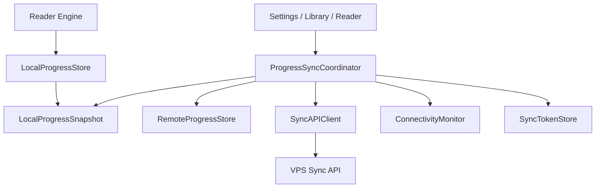
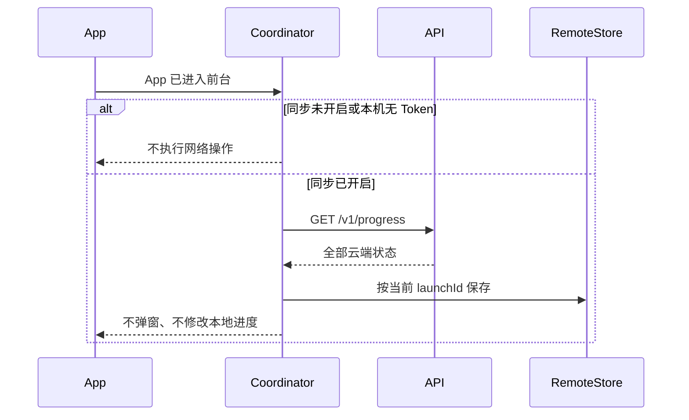

# XLib 阅读进度同步客户端设计

> 状态：第一阶段详细设计。本文同时约束 iOS 与 Android 客户端。同步是设置中的可选增值功能，未开启同步的用户仍可完整使用阅读器。服务端数据模型和接口见 [`sync-server-design.md`](sync-server-design.md)。

## 1. 目标与原则

客户端在不影响本地阅读体验的前提下，异步保存并同步当前书的最新阅读位置。

必须满足：

- 阅读、翻页和本地恢复不依赖同步 Token、网络或服务器；
- App 启动阶段只拉取云端状态，绝不上传本机进度；
- 只有打开具体书籍时才比较该书的本地和云端状态；
- 打开书籍和首次比较阶段仍不得上传；
- 进入正式阅读后，后台每 20 秒判断是否提交最新进度；
- 网络失败不建立 dirty、不保存失败请求、不补传历史 offset；
- 网络或服务恢复后只处理恢复时的最新进度；
- 阅读过程中不自动跳页、不显示冲突、不打断沉浸式阅读。

## 2. 功能范围

### 2.1 纳入

- 设置中的邮箱开启、关闭本机同步和状态展示；
- 设备身份和设备名称；
- TXT 文件 SHA-256 计算与缓存；
- 本地进度快照和云端进度快照；
- 启动时批量 pull-only；
- 单本书打开时的首次比较和一次性跳转提示；
- 正式阅读期间 20 秒后台同步；
- 进入后台时尽力提交一次；
- 网络监听、服务熔断、退避健康检查和 Token 失效处理。

### 2.2 不纳入

- TXT、书架、书名、作者、书签、目录、搜索索引、缓存和设置同步；
- 后台长期运行或常驻保活；
- 历史进度轨迹；
- dirty、失败上传队列、冲突列表和冲突解决中心；
- 阅读过程中来自其他设备的自动跳转。

## 3. 客户端组件



### 3.1 ProgressSyncCoordinator

同步流程的唯一协调者：

- 管理启动拉取；
- 管理当前阅读会话；
- 控制首次比较状态；
- 启停 20 秒定时器；
- 根据网络和服务状态决定是否发请求；
- 接收 API 最终状态并更新云端快照；
- 不直接修改阅读页面，跳转只能通过明确的用户动作回调 Reader。

### 3.2 LocalProgressStore

保留现有平台本地持久化的权威地位：

- iOS 继续由 `LibraryStore` actor 持久化正式 offset；
- Android 继续由 `BookStore` 保存正式 offset；
- 第一阶段不要求把全部书架迁移到 SQLite；
- 新增线程安全的不可变进度快照读取能力；
- 正式位置变化先完成本地提交，再发布给同步协调器。

### 3.3 RemoteProgressStore

独立保存服务器返回的状态：

- 按同步邮箱隔离；
- key 为 `bookHash + fileSize`；
- 不覆盖 LocalProgressStore；
- 保存 `fetchedAtMs` 和本次 App 会话的新鲜度；
- 关闭本机同步时清除内存、Token 和远端快照，但不删除本地书籍和进度；
- 只有当前 App 会话从服务器确认过的新鲜状态才可触发跳转提示。

### 3.4 SyncAPIClient

- 只实现服务端文档定义的 HTTPS JSON 接口；
- 基础地址来自本机同步设置，默认值为 `https://xunit.cc/xlib/backend`；
- 为每个请求设置有限超时；
- 不在 UI 或 Reader 线程解析大型响应；
- 401 时停止业务同步，不自动刷新或更换固定 Token；
- 不在 API Client 内部无限重试；
- 忽略未知响应字段，严格校验必需字段和范围。

### 3.5 ConnectivityMonitor

- 只报告系统网络可用性变化；
- 网络可用不等于同步服务可用；
- 网络恢复事件触发服务恢复流程；
- 监听器不直接上传数据，只通知协调器。

## 4. 平台实现映射

| 能力 | iOS | Android |
| --- | --- | --- |
| 同步状态串行化 | Swift actor | 单线程 `ExecutorService` 或等价串行执行器 |
| 网络监听 | `NWPathMonitor` | `ConnectivityManager.NetworkCallback` |
| HTTP | `URLSession` | 项目选定的单一 HTTP Client |
| 生命周期 | `scenePhase` / scene 通知 | `onStart/onResume/onPause/onStop` |
| 安全令牌 | Keychain | Android Keystore 支持的安全存储 |
| 本地正式进度 | `LibraryStore` | `BookStore` |
| 后台收尾 | 有限后台任务 | 生命周期内的有限异步任务 |

两端必须共享同一接口字段、阈值、时间规则和状态机；平台差异只存在于实现机制。

## 5. 本地数据结构

### 5.1 LocalProgressSnapshot

```text
LocalProgressSnapshot
├── localBookId       平台本地书籍 ID，不上传
├── bookHash          64 位小写 SHA-256
├── fileSize          Int64
├── offset            Int64
├── readAtMs          UTC Unix 毫秒
└── localSequence     进程内单调递增序号
```

规则：

- `offset` 是权威位置；
- `progress` 使用时由 offset/fileSize 计算；
- `localSequence` 只表明位置快照是否变化，不是 dirty；
- 每次正式位置变化，使用 `max(nowMs, previousReadAtMs + 1)` 生成单调的 `readAtMs`；
- 打开 App、打开书籍、显示菜单、同步成功或失败都不得更新 `readAtMs`；
- 搜索临时阅读不得发布正式进度快照。

### 5.2 RemoteProgressSnapshot

```text
RemoteProgressSnapshot
├── bookHash
├── fileSize
├── offset
├── progress
├── readAtMs
├── version
├── sourceDeviceId
├── sourceDeviceName
├── sourcePlatform
├── fetchedAtMs
└── freshForLaunchId
```

`freshForLaunchId` 用于证明状态来自当前 App 启动会话。旧缓存可以用于设置页展示，但不能直接触发跳转弹窗。

### 5.3 ReaderSyncSession

```text
ReaderSyncSession
├── sessionId
├── bookKey
├── comparisonState
├── promptedRemoteVersion
├── lastObservedSequence
└── startedAtMs
```

`comparisonState`：

| 状态 | 含义 |
| --- | --- |
| `pending` | 尚未取得并比较当前书云端状态，禁止上传。 |
| `awaitingJumpDecision` | 正在显示跳转弹窗，禁止上传。 |
| `completed` | 已完成首次比较，可以启动20秒上传判断。 |
| `unavailable` | 网络或服务暂不可用；恢复后必须先 pull 和比较，再允许上传。 |

## 6. TXT 哈希

- 使用文件原始字节计算 SHA-256；
- 哈希在后台 I/O 任务执行，不阻塞导入、书架或阅读；
- 结果与文件大小、修改时间一起缓存；
- 文件大小或修改时间变化时使缓存失效并重新计算；
- 哈希未准备好时仍可本地阅读，但暂不比较和同步该书；
- 不上传 TXT 内容、文件名、正文片段或本地路径；
- 哈希统一转成 64 位小写十六进制。

## 7. 同步开关和邮箱 Token

### 7.1 默认状态

- 新安装默认关闭阅读进度同步；
- 同步服务器地址默认写入 `https://xunit.cc/xlib/backend`，用户可在同步设置中修改并持久化；
- 地址必须是无用户名、密码、查询参数和片段的 HTTPS URL；保存时移除末尾 `/`；
- 本机没有 Token 时不创建同步定时器，不访问同步 API；
- 邮箱输入只存在于设置的同步功能中，不改变 App 根路由；
- 关闭本机同步保留全部本地书籍和本地进度。

### 7.2 首次开启

1. 用户进入“设置 → 阅读进度同步”；
2. 输入邮箱并点击“开始同步”；
3. 客户端登记稳定 `deviceId`、设备名称、平台和 App 版本；
4. 调用 `POST /v1/auth/start-sync`；服务端为新邮箱生成 Token，已有邮箱返回原来的同一个 Token；
5. 保存固定 Token 到平台安全存储；
6. 后续受保护请求同时发送 `Authorization: Bearer <token>` 和 `X-Device-Id`；
7. 调用 `GET /v1/progress` 只拉取云端状态；
8. 不扫描后立即上传本机进度；
9. 用户以后打开具体书籍时再进行首次比较。

### 7.3 关闭与更换邮箱

- 关闭同步仅清除本机 Keychain/Keystore 中的 Token，不调用服务端 logout；
- 清除 Token 和该邮箱的 RemoteProgressStore；
- 停止定时器、网络恢复同步和健康检查；
- 不清除 LocalProgressStore；
- 输入其他邮箱重新开启后先执行 pull-only，不能继承前一邮箱的远端快照。
- 重装或更换设备后，同样输入原邮箱即可取得同一个 Token 并恢复云端进度。

### 7.4 更换同步服务器

- 设置页提供“服务器地址”入口，可查看、编辑和保存基础地址；
- 修改后的地址保存在本机设置中，下次启动继续使用；
- 客户端在基础地址后追加 `/v1/...`，用户填写地址时不得重复追加 `/v1`；
- 保存与当前地址不同的新服务器时，立即停止同步并清除旧服务器的本机 Token 和 RemoteProgressStore；
- 更换服务器不删除本地书籍、本地阅读进度或旧服务器上的数据；
- 用户必须在新服务器上重新输入邮箱点击“开始同步”；
- 开发环境变量和构建配置只作为尚未保存用户地址时的初始覆盖值。

## 8. App 启动流程



硬性规则：

- 启动阶段只调用 `GET /v1/progress`；
- 启动阶段不得调用 `POST /v1/progress/sync`；
- 即使发现本机 `readAtMs` 更新，也不得上传；
- 批量拉取在后台执行，书架立即可用；
- 拉取失败只更新服务状态，不影响本地功能。

## 9. 打开单本书和首次比较

### 9.1 进入流程

1. 用户点击书籍；
2. 客户端立即使用本地 offset 准备 Reader，不等待网络；
3. 创建 ReaderSyncSession，初始状态为 `pending`；
4. 取得本地 bookHash 和 fileSize；
5. 优先读取当前 launchId 的 RemoteProgressSnapshot；
6. 若启动 pull 尚未完成，则后台取得当前邮箱最新状态后只选择当前书；
7. 完成该书的首次比较；
8. 比较阶段不得上传；
9. 状态成为 `completed` 后才允许 20 秒同步。

### 9.2 提示条件

只有同时满足以下条件才显示跳转弹窗：

```text
remote.readAtMs > local.readAtMs
remote.sourceDeviceId != currentDeviceId
abs(remote.offset - local.offset) / fileSize > 0.00001
remote.version 尚未在本次 ReaderSyncSession 提示
```

`0.00001` 等于 `0.001%`。实现时优先用整数或十进制定点计算，避免浮点边界误差。

不提示的情况：

- 本机时间更新；
- 时间相同；
- 差异小于或等于阈值；
- 文件哈希或大小不同；
- 云端状态来自当前设备；
- 没有云端状态；
- 相同 version 已提示过；
- 当前书仍在搜索临时阅读状态。

### 9.3 弹窗

文案模板：

> 是否跳转到在“{deviceName}”阅读的最新进度？  
> 位置：{offset}（{progressPercent}）  
> 进度于{relativeTime}保存。

示例：

> 是否跳转到在“iPhone 15 Pro”阅读的最新进度？  
> 位置：1,284,620（38.42%）  
> 进度于1天3小时12分钟前保存。

按钮：

- 暂不跳转；
- 跳转。

跳转：

- 使用 remote offset 更新本地正式位置；
- 本地保存 remote readAtMs，不生成新的阅读时间；
- 通过现有精确 byte offset 机制重新构建阅读窗口；
- 标记 remote version 已处理；
- 完成后进入 `completed`，不立即上传。

暂不跳转：

- 保持本地 offset 和 readAtMs；
- 标记 remote version 已提示；
- 进入 `completed`；
- 不立即上传本机旧状态。

### 9.4 云端状态暂不可用

- 不得阻塞本地 Reader；
- session 暂记为 `unavailable`；
- 此时不启动上传；
- 网络或服务恢复后先 pull 当前书并完成首次比较；
- 比较完成后再启用20秒上传；
- 不允许以“先上传再比较”的方式恢复。

## 10. 正式阅读期间的20秒同步

### 10.1 启动条件

只有同时满足以下条件才运行：

- 用户已主动开启同步且固定 Token 有效；
- App 在前台；
- 正式 Reader 会话存在；
- 当前书哈希已准备；
- `comparisonState == completed`；
- 当前不处于搜索临时阅读；
- 网络和服务状态允许请求。

### 10.2 周期行为

每20秒唤醒一次协调器：

1. 读取当前最新 LocalProgressSnapshot；
2. 若 `localSequence == lastObservedSequence`，不发请求；
3. 若有变化，先把本次序号记为 `lastObservedSequence`；
4. 调用 `POST /v1/progress/sync`；
5. 用响应最终状态更新 RemoteProgressStore；
6. 不管响应是 accepted 或 server_kept，都不得自动修改正在阅读的本地 offset。

`lastObservedSequence` 在发起请求时更新，而不是成功后更新。因此失败的同一快照不会在下一个20秒周期自动重试。用户继续翻页会产生新序号，下次只提交新的最新快照。

### 10.3 阅读线程发布顺序

```text
用户翻页或正式跳转
    -> 更新 Reader 当前页
    -> 保存本地 offset
    -> 生成单调 readAtMs
    -> 发布新的 LocalProgressSnapshot
    -> 阅读线程结束本次操作

同步线程稍后独立读取快照
```

同步请求、JSON 编码、网络等待和响应处理都不得位于翻页关键路径。

### 10.4 服务端返回更新状态

若返回 `accepted`：

- 更新 RemoteProgressStore；
- 不显示成功提示。

若返回 `server_kept`：

- 更新 RemoteProgressStore；
- 当前阅读页保持不变；
- 不显示冲突或跳转提示；
- 用户后续实际改变位置时产生更新 readAtMs，再按下一周期自然提交。

若返回 `unchanged`：

- 更新最后成功时间；
- 不做其他动作。

## 11. 不使用 dirty 和失败队列

明确禁止：

- 为进度增加 dirty 字段；
- 保存待上传 offset 列表；
- 保存失败 HTTP 请求；
- 对同一失败进度做固定间隔重试；
- 网络恢复后补传每个历史页面；
- 为同步成功删除或确认本地阅读记录。

失败请求的请求体在请求结束后释放。正确性依赖本地权威进度和下一次读取最新快照，而不是依赖任务队列。

允许保存的是“同步服务运行状态”，不是“待同步数据”。

## 12. 同步可用性状态机

```text
SyncAvailability
├── available
├── offline
├── serviceUnavailable
└── tokenRequired
```

可选诊断字段：

```text
lastAttemptAtMs
lastSuccessAtMs
lastFailureCode
serviceProbeAttempt
nextProbeAtMs
```

### 12.1 网络断开

- 系统网络监听报告断开时进入 `offline`；
- 20秒定时器不发业务请求；
- 不通过 HTTP 轮询网络是否恢复；
- 本地进度照常更新；
- 系统报告网络恢复时先恢复服务检查；
- 若当前 Reader 首次比较未完成，先 pull 和比较；
- 已完成比较时，立即读取当前最新快照并同步一次；
- 不补传断网期间的历史 offset。

### 12.2 服务不可用

连接超时、连接失败、HTTP 500 或 503 时：

- 进入 `serviceUnavailable`；
- 暂停20秒业务同步请求；
- 丢弃失败请求，不创建队列；
- 使用 `GET /health` 低频探测。

退避：

```text
30秒 -> 1分钟 -> 2分钟 -> 5分钟 -> 每5分钟一次
```

健康检查成功后：

1. 调用 `GET /v1/progress` 或取得当前书最新状态；
2. 当前 Reader 尚未完成首次比较时，先比较；
3. 比较完成后才允许上传；
4. 读取恢复时的最新本地快照同步一次；
5. 恢复正常20秒周期。

### 12.3 限流

- 收到 429 时尊重 `Retry-After`；
- 冷却期间不发业务同步请求；
- 冷却结束后按服务恢复流程先刷新云端状态；
- 不重试原始失败请求。

### 12.4 Token 失效

- 401 后不刷新、不轮换、不重试原请求；
- 进入 `tokenRequired`；
- 停止20秒同步和健康检查；
- 只在设置页显示“需要重新开启”；
- 阅读页、书架和本地进度不受影响；
- 用户重新输入邮箱点击“开始同步”后，服务端返回该邮箱原 Token；客户端先执行 pull-only，不能直接上传本机进度。

### 12.5 不可重试的请求错误

400、403、413、422 等错误：

- 不重试相同快照；
- 记录匿名化错误码用于诊断；
- 403 邮箱或设备状态错误时暂停同步；
- 书籍字段错误只停用该书同步，不影响其他书和阅读；
- 不向阅读页面弹出技术错误。

## 13. 生命周期

### 13.1 进入后台

当 App 进入后台：

- 停止20秒定时器；
- 若存在正式 Reader 会话、首次比较已完成且服务可用，读取最新快照并尽力提交一次；
- 不等待请求完成才允许进入后台；
- 不为失败请求建立队列；
- 若首次比较未完成、离线、服务不可用或 Token 失效，则不强制请求；
- 本地进度已提前保存，因此即使进程被终止也不丢失本地位置。

### 13.2 回到前台

- 恢复网络和 Token 状态；
- App 级同步仍先执行 pull-only；
- 若恢复原 Reader 会话，按当前书首次比较状态决定是否需要先比较；
- 不因为回到前台批量弹出跳转提示；
- 只有当前书能够显示一次跳转提示。

### 13.3 正常关闭与强制终止

移动平台不保证真正的关闭回调。设计只承诺：

- 生命周期允许时尽力提交最新状态；
- 强制终止不会损坏本地进度；
- 未上传进度不进入失败队列；
- 下次启动仍先 pull-only；
- 用户再次打开该书并完成首次比较后，阅读阶段再决定上传。

## 14. 设置页面

新增“阅读进度同步”区域。

服务器配置：

- 显示当前服务器地址；
- 默认 `https://xunit.cc/xlib/backend`；
- 可编辑并保存；
- 地址无效时在设置页提示，不影响本地阅读；
- 已开启同步时修改地址，要明确说明旧 Token 将从本机清除。

未开启：

- 状态：未开启；
- 说明：输入邮箱后可在不同设备间同步阅读进度；
- 操作：开始同步。

已开启：

- 当前邮箱；
- 当前设备名称；
- 状态：已连接、离线、服务暂不可用、需要重新开启；
- 最后成功同步时间；
- “刷新云端状态”：只调用 GET `/v1/progress`，不得上传；
- 设备管理；
- 关闭本机同步；
- 删除云端同步数据。

不得增加：

- 同步冲突入口；
- dirty 数量；
- 待处理任务数量；
- 阅读页错误提示；
- 强制同步进度按钮。

## 15. 接口调用矩阵

| 场景 | 接口 | 是否允许上传 | UI 行为 |
| --- | --- | --- | --- |
| App 启动 | `GET /v1/progress` | 否 | 后台静默执行。 |
| 修改服务器地址 | 无服务端请求 | 否 | 保存地址并清除旧服务器的本机 Token。 |
| 邮箱开始同步 | 先 `POST /v1/auth/start-sync`，再 `GET /v1/progress` | 否 | 保存 Token，保持设置页可操作。 |
| 打开单本书 | 优先本地云端快照；必要时刷新 pull | 否 | 只判断一次跳转提示。 |
| 首次比较等待选择 | 无上传 | 否 | 显示“暂不跳转/跳转”。 |
| 正式阅读每20秒 | `POST /v1/progress/sync` | 是 | 静默，不自动跳页。 |
| 进入后台 | `POST /v1/progress/sync` | 条件允许时尽力 | 不阻塞退出。 |
| 网络恢复 | 先 pull；比较完成后 sync | 有条件 | 不补传历史位置。 |
| 服务恢复 | 先 pull；比较完成后 sync | 有条件 | 静默恢复。 |
| 设置刷新 | `GET /v1/progress` | 否 | 更新状态和时间。 |
| 关闭本机同步 | 无服务端请求 | 否 | 删除本机 Token，保留本地和云端数据。 |

## 16. 客户端安全与隐私

- 固定同步 Token 只存平台安全存储；
- Token 必须与服务器地址绑定；切换服务器时不得把旧 Token 发送到新服务器；
- 日志不记录 Token、邮箱、完整 bookHash、文件路径或正文；
- HTTP 仅允许 HTTPS；
- 不上传书名、作者、TXT 内容和搜索片段；
- 服务端返回 offset 必须重新校验范围；
- 只有哈希和文件大小完全一致才允许比较或跳转；
- 关闭本机同步立即停止后台同步；
- 删除云端进度前使用明确的破坏性确认，但不得删除本地数据；
- 跳转弹窗设备名称按普通文本显示，不能解释为富文本或 HTML。

## 17. 客户端测试

### 17.1 单元测试

- `0.001%` 阈值边界；
- offset 到 progress 的计算；
- readAtMs 单调生成；
- 书籍哈希匹配；
- 跳转提示全部条件；
- 相同 version 每会话只提示一次；
- 启动 pull-only 不产生 sync 请求；
- 首次比较完成前禁止上传；
- lastObservedSequence 在失败后不重试同一快照；
- 服务状态转换和健康检查退避。

### 17.2 集成测试

- iOS 与 Android 导入同一 TXT 后匹配；
- 两台设备先后阅读并在再次打开时提示跳转；
- 选择跳转后精确恢复 offset；
- 选择暂不跳转后继续阅读并自然产生新状态；
- 阅读过程中另一设备更新，不跳页、不弹窗；
- 启动拉取失败仍可本地阅读；
- 断网期间持续翻页，恢复后只提交最新位置；
- 服务 503 后不每20秒请求，恢复后重新同步；
- Token 失效不影响阅读；
- App 进入后台和被强制终止后的本地恢复。

### 17.3 性能测试

- 20秒定时器不在主线程执行网络与 JSON 工作；
- 翻页路径不增加网络等待；
- 大书哈希在后台流式计算，不整本载入内存；
- 启动批量拉取不阻塞首屏；
- 服务不可用时请求数符合退避上限。

## 18. 客户端完成标准

- 同步关闭时行为与当前版本一致；
- 首次安装显示默认服务器地址，修改后能够跨启动保存；
- 未开启同步可使用所有现有基础功能；
- App 启动、邮箱开始同步后的首次拉取和设置刷新全部 pull-only；
- 只有当前打开的书做首次比较；
- 比较阶段不上传；
- 正式阅读开始后才允许20秒上传判断；
- 阅读线程与同步线程完全解耦；
- 失败请求不排队、不重复上传同一快照；
- 断网和服务故障不产生高频请求；
- 任何服务端响应都不能在阅读过程中自动改变页面；
- iOS 与 Android 对接口、阈值、时间和生命周期规则理解一致。
