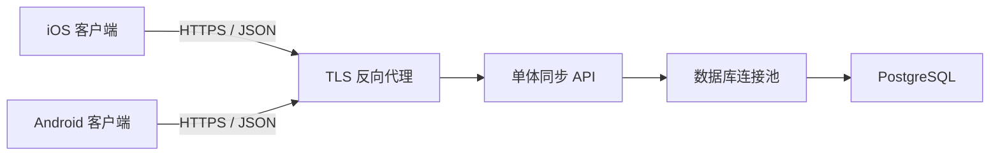

# XLib 阅读进度同步服务端设计

> 状态：第一阶段详细设计。本文只设计可选的阅读进度同步服务，不改变 XLib 无账号也可完整使用的产品边界。客户端行为见 [`sync-client-design.md`](sync-client-design.md)。

## 1. 目标与边界

服务端为已经主动开启同步的用户保存每本 TXT 的最新阅读进度，并在多个设备提交状态时使用统一的时间规则选出唯一状态。

第一阶段服务端负责：

- 邮箱、固定同步 Token 和设备元数据管理；
- 按用户保存 TXT 阅读进度；
- 启动阶段批量返回用户的全部云端进度；
- 阅读阶段原子比较并接收时间更新的进度；
- 提供轻量健康检查，支持客户端暂停与恢复同步；
- 提供云端同步数据删除能力。

第一阶段不负责：

- 保存或分发 TXT 原文件；
- 同步书架、书名、作者、目录、书签、搜索索引、阅读缓存或设置；
- 保存每次翻页的历史轨迹；
- 建立冲突记录、冲突队列或人工解决流程；
- 向客户端推送阅读跳转指令；
- 在客户端未主动开启同步时接收任何阅读数据。

## 2. 总体架构



建议保持一个可独立部署的单体 API：

- API 层负责同步 Token 校验、参数校验、限流和响应转换；
- 领域层负责进度裁决和设备归属校验；
- 数据层只通过短事务访问 PostgreSQL；
- 客户端不得直连数据库；
- 数据库不暴露公网端口；
- 第一阶段没有文件存储卷。

具体 HTTP 框架可在实现前确定，但不得改变本文接口和裁决语义。服务端内部 ID 使用 PostgreSQL `bigint identity`，外部公开标识使用 UUID。

## 3. 核心术语

| 术语 | 定义 |
| --- | --- |
| `bookHash` | TXT 原始字节的 SHA-256，小写十六进制，共 64 个字符。 |
| `bookKey` | 用户范围内由 `bookHash + fileSize` 确定的书籍身份；不使用 Android/iOS 本地书籍 ID。 |
| `offset` | TXT 原始文件中的绝对 byte offset，是权威阅读位置。 |
| `progress` | `offset / fileSize`，由服务端计算，仅用于显示和阈值判断。 |
| `readAtMs` | 正式阅读位置最后一次变化的 UTC Unix 毫秒时间。 |
| `version` | 服务端进度记录版本；API 中为不透明十进制字符串，客户端只能比较相等性。 |
| `deviceId` | 客户端生成并安全持久化的 UUID；同一安装实例保持稳定。 |
| `syncToken` | 每个规范化邮箱唯一且长期固定的不透明随机 Token；所有设备共享。 |
| `serverTimeMs` | 服务端生成响应时的 UTC Unix 毫秒时间。 |

## 4. 进度裁决规则

### 4.1 正常裁决

每个用户、每个 `bookKey` 在服务器上只保留一条当前状态。收到客户端候选状态时：

```text
incoming.readAtMs > stored.readAtMs
    接收 incoming

incoming.readAtMs < stored.readAtMs
    保留 stored

incoming.readAtMs == stored.readAtMs
    同设备且 offset 相同：视为重复请求，保留 stored
    其他情况：按 deviceId 的稳定字典序确定唯一结果
```

客户端必须保证同一设备内 `readAtMs` 单调递增：正式位置发生变化时使用 `max(currentUtcMs, previousReadAtMs + 1)`。因此相同设备、相同时间、不同位置只能来自异常或旧客户端。

服务端永远返回裁决后的最终云端状态。客户端在阅读过程中不得因为返回了云端状态而自动跳页。

### 4.2 时间异常

- 服务端允许正常的历史时间，以支持设备离线阅读后再同步；
- 若 `readAtMs` 超过 `serverTimeMs + 5 分钟`，服务端把有效时间收敛为当前 `serverTimeMs`，并在结果中返回 `timeAdjusted: true`；
- 服务端不接受负数时间或无法表示的整数；
- `receivedAt` 只用于审计和诊断，不代替真实阅读时间参与正常裁决。

### 4.3 位置校验

- `fileSize` 必须大于 0；
- `offset` 必须满足 `0 <= offset <= fileSize`；
- `progress` 不由客户端提交，服务端根据 offset 和 fileSize 计算；
- 相同哈希但文件大小不同的记录视为不同 `bookKey`，不得混合；
- 服务端不接收书名、正文片段或本地文件路径。

## 5. 数据模型

所有时间列使用 `timestamptz`，哈希使用固定 32 字节 `bytea`，内部主键使用 `bigint identity`。以下为逻辑结构，最终迁移脚本应使用小写标识符和显式约束名。

### 5.1 users

| 字段 | 类型 | 规则 |
| --- | --- | --- |
| `id` | `bigint identity` | 主键，内部使用。 |
| `public_id` | `uuid` | 唯一，API 对外标识。 |
| `email_normalized` | `text` | 唯一；去首尾空白并转小写后的邮箱。 |
| `token_hash` | `bytea` | 唯一；用于校验 Bearer Token，不保存日志。 |
| `token_ciphertext` | `bytea` | 使用 VPS 主密钥加密，用于同邮箱再次开启时返回同一个 Token。 |
| `status` | `text` | `active/disabled/deleting` 检查约束。 |
| `created_at` | `timestamptz` | 创建时间。 |
| `updated_at` | `timestamptz` | 最后更新时间。 |

### 5.2 devices

| 字段 | 类型 | 规则 |
| --- | --- | --- |
| `id` | `bigint identity` | 主键。 |
| `user_id` | `bigint` | 外键到 users，级联删除。 |
| `device_uid` | `uuid` | 客户端稳定设备 ID。 |
| `device_name` | `text` | 弹窗显示名称，去首尾空白后 1–80 字符。 |
| `platform` | `text` | `ios/android` 检查约束。 |
| `app_version` | `text` | 最近上报版本。 |
| `last_seen_at` | `timestamptz` | 最近成功使用同步服务的时间。 |
| `revoked_at` | `timestamptz` | 可空；用户移除设备时设置，保留历史来源信息。 |
| `created_at` | `timestamptz` | 创建时间。 |

约束与索引：

- 唯一约束 `(user_id, device_uid)`；
- 索引 `devices(user_id)`，支持设备列表和用户删除。

### 5.3 reading_progress

| 字段 | 类型 | 规则 |
| --- | --- | --- |
| `id` | `bigint identity` | 主键。 |
| `user_id` | `bigint` | 外键到 users，级联删除。 |
| `book_hash` | `bytea` | 精确 32 字节。 |
| `file_size` | `bigint` | `> 0`。 |
| `offset_bytes` | `bigint` | `>= 0` 且 `<= file_size`。 |
| `read_at` | `timestamptz` | 参与裁决的阅读时间。 |
| `device_id` | `bigint` | 外键到 devices。 |
| `version` | `bigint` | 初始为 1，每次真实替换加 1。 |
| `received_at` | `timestamptz` | 服务端接收当前状态的时间。 |
| `updated_at` | `timestamptz` | 数据库更新时间。 |

约束与索引：

- 唯一约束 `(user_id, book_hash, file_size)`，同时支持单本裁决；
- 索引 `reading_progress(user_id)`，支持启动时批量拉取；
- 索引 `reading_progress(device_id)`，支持设备删除和诊断；
- 不持久化浮点 progress，响应时计算，避免舍入不一致。

### 5.4 数据库访问原则

- 应用数据库账号不得使用超级用户；
- 仅授予所需表的 `select/insert/update/delete` 权限；
- 撤销 schema 和表的公共默认权限；
- API 查询必须同时包含 Token 所属的 `user_id`，不得只按公开 ID 查询；
- 所有外键列建立索引；
- 使用连接池，不为每个 HTTP 请求新建数据库连接；
- 事务内不得调用外部服务或执行 Token 加解密；
- 批量裁决按 `book_hash, file_size` 稳定排序，并保持短事务，降低死锁概率。

## 6. 原子更新算法

单本同步必须通过一个带条件的 PostgreSQL UPSERT 完成，禁止先 SELECT 再 UPDATE。逻辑如下：

```sql
insert into reading_progress (...)
values (...)
on conflict (user_id, book_hash, file_size)
do update set
    offset_bytes = excluded.offset_bytes,
    read_at = excluded.read_at,
    device_id = excluded.device_id,
    version = reading_progress.version + 1,
    received_at = now(),
    updated_at = now()
where
    excluded.read_at > reading_progress.read_at
    or (
        excluded.read_at = reading_progress.read_at
        and excluded.device_id > reading_progress.device_id
    )
returning ...;
```

若条件不成立且 `RETURNING` 无结果，服务端在同一请求内重新读取现有记录并返回 `server_kept`。实现时必须确保设备属于当前邮箱；不能允许用户提交其他邮箱的 `deviceId`。

批量同步上限为 100 条。第一阶段客户端正常只提交当前阅读书籍的一条记录，但接口保留批量形态用于生命周期提交和未来扩展。

## 7. HTTP 通用规则

### 7.1 传输

- 基础路径：`/v1`；
- 生产环境只允许 HTTPS；
- 请求和响应使用 UTF-8 JSON；
- `Content-Type: application/json`；
- 访问令牌使用 `Authorization: Bearer <token>`；
- 除 `POST /v1/auth/start-sync` 和健康检查外，客户端必须同时发送 `X-Device-Id`；
- 所有毫秒时间为 JSON 安全整数；
- 所有 UUID 使用小写连字符格式；
- `bookHash` 使用小写 64 位十六进制；
- 客户端未知的响应字段必须忽略，以便兼容扩展。

### 7.2 通用响应头

- `X-Request-Id`：服务端请求追踪 ID；
- `Cache-Control: no-store`：Token 发放与进度接口；
- `Retry-After`：限流或临时不可用时可选返回。

### 7.3 通用错误格式

```json
{
  "error": {
    "code": "VALIDATION_FAILED",
    "message": "offset must be between 0 and fileSize",
    "retryable": false,
    "requestId": "4d986f3e-7cf6-4cc4-a150-df43512b7d38"
  }
}
```

| HTTP 状态 | 含义 | 客户端规则 |
| --- | --- | --- |
| `400` | JSON 或字段格式错误 | 不重试同一状态。 |
| `401` | 同步 Token 无效 | 暂停同步，提示用户重新输入邮箱开启。 |
| `403` | 邮箱禁用或无权访问设备 | 暂停同步。 |
| `404` | 资源不存在 | 按接口语义处理，不自动循环重试。 |
| `413` | 批量条目或请求过大 | 拆分或停止同一请求。 |
| `422` | 字段可解析但违反业务约束 | 不重试同一状态。 |
| `429` | 限流 | 按 `Retry-After` 暂停。 |
| `500` | 服务内部错误 | 标记服务不可用。 |
| `503` | 服务暂时不可用 | 标记服务不可用。 |

## 8. 同步 Token 与设备接口

第一阶段不设置密码，不区分注册和登录，也不提供 Access Token、Refresh Token、刷新或服务端 logout。用户只需用邮箱开启同步。

### 8.1 POST /v1/auth/start-sync

根据邮箱创建或恢复同步身份，并登记当前设备。

请求：

```json
{
  "email": "reader@example.com",
  "device": {
    "deviceId": "7ce2a4d2-3fdb-4dce-93e7-8bc67e3f9677",
    "deviceName": "iPhone 15 Pro",
    "platform": "ios",
    "appVersion": "1.0.0"
  }
}
```

规则：

- 服务端把邮箱去首尾空白并转为小写；
- 邮箱不存在时，生成至少 256 bit 密码学安全随机 Token，创建用户和设备；
- 邮箱已存在时，解密并返回原来的同一个 Token，更新或创建当前设备；
- 无论新建还是恢复均返回 `200 OK`，响应形态一致，不能通过状态码判断邮箱是否已有数据；
- 成功后客户端立即保存 Token，再执行一次 pull-only；
- 此接口不得接收本机进度。

成功响应：

```json
{
  "token": "opaque-fixed-sync-token",
  "user": {
    "userId": "c124519e-c137-44c8-9ab1-bbe5c08f73ba",
    "email": "reader@example.com"
  },
  "device": {
    "deviceId": "7ce2a4d2-3fdb-4dce-93e7-8bc67e3f9677",
    "deviceName": "iPhone 15 Pro",
    "platform": "ios"
  },
  "serverTimeMs": 1784710800000
}
```

### 8.2 GET /v1/devices

返回当前邮箱的设备列表，用于设置页面设备管理。

### 8.3 DELETE /v1/devices/{deviceId}

把目标设备标记为已撤销。后续携带该 `X-Device-Id` 的业务请求返回 `403`；设备行不物理删除，以便历史进度继续显示来源名称。该操作不改变共享 Token，也不删除阅读进度。该设备再次输入邮箱点击“开始同步”时重新启用。

### 8.4 DELETE /v1/account

删除当前邮箱、固定 Token、全部设备和阅读进度，成功后返回 `204 No Content`。请求以固定 Token 授权；客户端必须使用明确的破坏性确认。它不会也不能删除任何客户端本地书籍或进度。

## 9. 阅读进度接口

### 9.1 GET /v1/progress

用途：App 启动或同步服务恢复后，批量拉取当前邮箱的全部云端进度。

重要规则：这是 pull-only 接口。调用它不会读取、接收或修改任何本机进度。

成功响应：

```json
{
  "serverTimeMs": 1784710800000,
  "items": [
    {
      "bookHash": "d8f2b4873f0b71b6fdfca1f55f65e17100f15b06cb74cb90cdabf936c18c4f2a",
      "fileSize": 3349120,
      "offset": 1284620,
      "progress": 0.383571,
      "readAtMs": 1784600000000,
      "version": "12",
      "device": {
        "deviceId": "7ce2a4d2-3fdb-4dce-93e7-8bc67e3f9677",
        "deviceName": "iPhone 15 Pro",
        "platform": "ios"
      }
    }
  ]
}
```

规则：

- `200 OK` 即使没有记录也返回空数组；
- 按 `bookHash, fileSize` 稳定排序；
- 第一阶段返回全部状态，不分页；
- 单邮箱记录硬上限建议为 10,000，超过后服务端拒绝继续创建新记录并记录告警；
- 响应不得包含书名、正文、路径或其他设备隐私信息。

### 9.2 POST /v1/progress/sync

用途：正式阅读会话开始后，客户端提交当前最新进度，由服务器进行时间裁决。

请求：

```json
{
  "items": [
    {
      "bookHash": "d8f2b4873f0b71b6fdfca1f55f65e17100f15b06cb74cb90cdabf936c18c4f2a",
      "fileSize": 3349120,
      "offset": 1284620,
      "readAtMs": 1784710798123
    }
  ]
}
```

成功响应：

```json
{
  "serverTimeMs": 1784710800000,
  "results": [
    {
      "decision": "accepted",
      "timeAdjusted": false,
      "state": {
        "bookHash": "d8f2b4873f0b71b6fdfca1f55f65e17100f15b06cb74cb90cdabf936c18c4f2a",
        "fileSize": 3349120,
        "offset": 1284620,
        "progress": 0.383571,
        "readAtMs": 1784710798123,
        "version": "13",
        "device": {
          "deviceId": "7ce2a4d2-3fdb-4dce-93e7-8bc67e3f9677",
          "deviceName": "iPhone 15 Pro",
          "platform": "ios"
        }
      }
    }
  ]
}
```

`decision` 取值：

| 值 | 含义 |
| --- | --- |
| `accepted` | 本机候选状态成为新的云端状态。 |
| `server_kept` | 服务器已有状态更新或时间相同且按确定性规则获胜。 |
| `unchanged` | 提交状态与服务器状态完全相同，没有增加 version。 |

规则：

- 每次最多 100 条；重复 `bookKey` 返回 `422`；
- 服务端用 `X-Device-Id` 查找当前 Token 所属用户的设备；设备必须已登记且未撤销；
- 每个结果都返回最终云端状态；
- 部分字段不合法时整个请求返回 `422`，不做部分写入；
- 批量条目按稳定顺序裁决；
- 客户端启动和单本首次比较阶段不得调用此接口；这是客户端强制约束，服务端无法仅凭请求判断 UI 所处阶段。

### 9.3 DELETE /v1/progress

删除当前邮箱下的全部云端阅读进度，成功返回 `204 No Content`。固定 Token 即为授权凭据；此操作与删除同步身份分开。

## 10. 健康检查

### GET /health

用途：负载均衡检查以及客户端在服务暂时不可用后的低频恢复探测。

成功：

```json
{
  "status": "ok"
}
```

规则：

- 不需要同步 Token；
- 不返回版本、数据库地址、异常堆栈或其他内部信息；
- API 与数据库均可处理请求时返回 `200`；
- 暂时不可用返回 `503`；
- 必须轻量，客户端退避探测不能触发昂贵查询。

## 11. 并发与一致性

- 同一用户可从多台设备并发调用同步接口；
- 数据库唯一约束和条件 UPSERT 是唯一裁决点；
- API 进程内锁不能作为正确性基础；
- 相同请求重复到达不会产生错误覆盖；
- 只有真实替换进度时增加 version；
- 批量请求要么全部通过字段校验后执行，要么不写入；
- 网络响应丢失不会要求客户端重试旧请求，后续提交最新状态仍能正确裁决；
- 服务端不得要求客户端维护 dirty、上传队列或操作日志。

## 12. 安全要求

- 固定 Token 必须由密码学安全随机数生成器产生，至少 256 bit；
- 数据库保存 Token 哈希用于校验，并保存经 VPS 主密钥认证加密的密文用于同邮箱恢复；不得保存明文 Token；
- `start-sync` 必须按 IP 和规范化邮箱限流，业务接口按 Token 和设备限流；
- 所有数据访问必须受当前 `user_id` 约束；
- 日志不得写入邮箱、Token、TXT 内容或完整请求体；
- `bookHash` 仍属于用户数据，不用于跨邮箱公开查重；
- 错误响应不泄露邮箱是否存在、数据库结构或堆栈；
- 生产环境密钥只放 VPS 的 `.env`，不得进入仓库；
- 支持删除全部云端进度和删除同步身份；删除身份应级联删除设备与进度。
- 仅凭邮箱即可取得 Token 不构成强身份认证；这是当前产品明确接受的简化边界，接口必须限流且不得承载敏感正文。

## 13. VPS 部署与运行

第一阶段使用 Docker Compose：

```text
/opt/apps/xlib-sync/
├── repo/
├── .env
├── docker-compose.override.yml
└── backups/
```

服务组成：

- TLS 反向代理；
- 同步 API；
- PostgreSQL；
- 可选的轻量连接池组件，或由 API 使用受限连接池。

要求：

- 只公开 HTTPS 端口；
- 数据库使用持久化卷且不公开端口；
- 每日备份数据库，定期执行恢复演练；
- 数据库迁移先备份再执行；
- 健康检查失败不得自动删除或重建数据库卷；
- 记录请求量、错误率、接口延迟、数据库连接数和健康状态；
- 生产部署、重启和回滚必须单独确认，不属于本文档编写范围。

## 14. 服务端测试与验收

### 14.1 单元测试

- 新记录首次写入；
- 本机时间更新时替换；
- 本机时间较早时保留服务器；
- 相同状态重复提交返回 unchanged；
- 相同时间的跨设备确定性裁决；
- offset 边界和哈希格式校验；
- 未来时间调整；
- progress 计算精度。

### 14.2 并发测试

- 两设备同时更新同一本书；
- 相同请求重复到达；
- 100 条批量请求稳定排序；
- 响应丢失后提交更新状态；
- 数据库事务无长时间锁和死锁。

### 14.3 接口测试

- 首次邮箱创建返回新 Token，同邮箱再次请求返回完全相同的 Token；
- 新设备使用同邮箱恢复 Token，并能拉取已有进度；
- 缺少、错误 Token 或缺少 `X-Device-Id` 时拒绝访问进度接口；
- 设备不能访问其他邮箱的进度；
- GET `/v1/progress` 无副作用；
- POST `/v1/progress/sync` 返回最终状态；
- 限流、503 和统一错误格式；
- 删除云端进度不影响客户端本地数据。

### 14.4 完成标准

- 启动拉取接口永不修改进度；
- 单一唯一约束保证每个用户、每本书只有一个云端状态；
- 时间更新规则在并发下仍保持确定性；
- 服务故障不会要求客户端补传历史 offset；
- 数据库备份可恢复；
- 除已明确接受的“邮箱即可恢复固定 Token”产品风险外，未发现跨邮箱访问、令牌泄漏或未校验输入等其他高风险问题。
