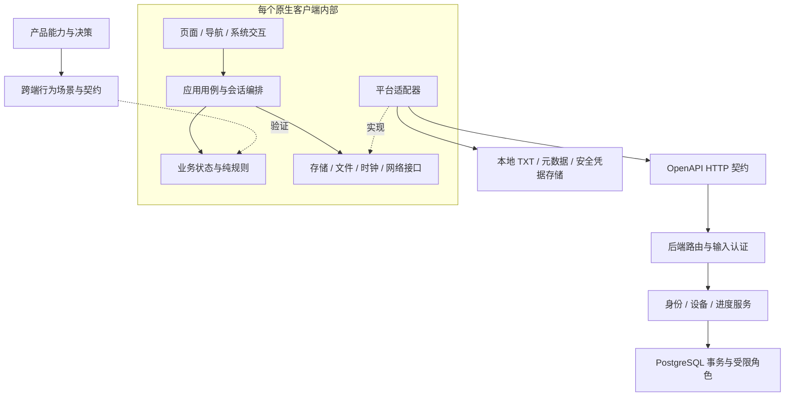

# XLib 系统架构重构计划

状态：P0–P7.3 已完成当前工作树实现，P8 系统验收进行中。0.10.0 是 released/tagged 的 SQLite 强制迁移基线；0.11.0 draft 已完成旧运行时删除、设备 legacy allowlist 清理和一次性 migrator 退役。P8 自动发布门禁与双端 SQLite 容量故障回滚已落地，真实双端、分发版本下限和性能证据尚未完成。验收边界见 CURRENT 和 [P8 System Validation](architecture/p8-system-validation.md)。本文是工程迁移计划，不新增产品能力、不代表发布授权。当前架构见 [architecture](architecture.md)，P6 证据见 [移动端本地存储审计](architecture/local-storage-audit.md)和 [Local Storage Contract](architecture/local-storage-contract.md)，P7 边界见 [Legacy Persistence Cleanup](architecture/legacy-persistence-cleanup.md)，历史安装覆盖证据见 [Pre-P7.1 Upgrade Validation](architecture/pre-p7-upgrade-validation.md)，业务规则以 [产品能力](product/README.md) 和 [矩阵](product/matrix/capability-matrix.md) 为准。

## 1. 目标与范围

保持现有 Android、iOS 原生客户端与可选同步服务，让阅读、搜索、书库、同步可以独立验证和修改。优先保护原始字节位置、真实阅读时间、本地数据及身份隔离，再降低功能迭代时需要同时修改多个模块的范围。

本计划覆盖客户端、Apple 共享核心、HTTP 契约、后端、持久化、测试、构建和发布边界。保留 Java、Swift、TypeScript 与 Backend PostgreSQL；P6 只把 Android/iOS 的结构化本地数据收敛到 SQLite，不把后端改成 SQLite，也不迁移语言或 UI 框架。不引入微服务、消息队列或跨语言共享运行时。macOS 仍无应用目标，Windows/Web 仍未评估，不为未来端建立空实现。

## 2. 当前问题与证据

| 范围 | 当前证据 | 风险与重构方向 |
|---|---|---|
| Android 页面组织 | `MainActivity.java` 约 5,224 行，负责多个页面、导入、阅读任务和生命周期 | 页面操作容易影响阅读/同步状态；按用户流程提取控制器，Activity 最终只承担装配、导航与生命周期转发 |
| Android 同步 | `ProgressSyncCoordinator.java` 约 978 行；已有 `ReadingSyncPhase`、`SyncRules`、阅读 token 与配置代次 | 保留已验证保护，分离状态转换、网络执行和凭据配置；不重新另写一套完整同步引擎 |
| iOS 同步 | `ProgressSyncCoordinator.swift` 约 850 行，持有身份、阅读会话、定时、网络恢复、删除队列 | 将阅读会话和身份会话分开建模，副作用由协调层串行执行 |
| 进度数据 | Android `BookStore`、内存 `LocalProgressStore`；iOS `Book.updatedAt` 被用于 readAtMs | 多个对象承载同一语义，导入时间与阅读时间混用；建立明确进度模型及单一写入入口 |
| P0 已解决的业务冲突 | iOS 新导入时间改为 0，上传拒绝未知时间；Schema 与历史记录保留 | 回归已覆盖导入/重开、首次位移、准备期及真实云端比较；不把旧错误行为固化为兼容要求 |
| 阅读核心 | Android 已分离字节映射、缓存、分页窗口；AppleShared 已有编码/字节映射 | 保留成熟核心，优先抽离调度与页面依赖，不重写分页算法 |
| 后端 | P5 已将身份与进度 SQL 收口到 Repository；service 保留事务与业务编排 | 维持 PostgreSQL 模块化单体；以受限运行角色和真实数据库并发测试持续保护事务边界 |
| 移动端本地存储 | Android 使用 SharedPreferences/JSON 与普通缓存文件；iOS 使用 Application Support JSON、UserDefaults 与 Keychain；两端均无 SQLite | P6 将结构化业务数据和非敏感设置收敛到 SQLite，TXT 与安全凭据保持独立边界 |
| 契约校验 | `scripts/check-contract.rb` 当前核对路由路径和方法 | 不能证明请求/响应字段及错误语义一致；增加 Schema 与客户端序列化一致性检查 |
| 发布验证 | P8 已让 `check-alpha.sh` 强制运行隔离 PostgreSQL 17、双端测试及版本文件快照，并增加 tracked-sensitive-data 门禁 | 自动门禁已收口；真实双端、实际分发版本下限和性能仍须独立记录 |
| 架构说明 | 现有 architecture 第 1–7 节主要是 Android 细节 | 实施中逐步维护系统总览与端内说明，避免把 Android 技术要求传播给其他端 |

行数仅用于定位职责集中点，不作为拆分成功指标。

## 3. 目标结构与依赖

- 业务规则层不引用 Activity、SwiftUI、URLSession、HTTP 客户端或数据库驱动。
- 应用层定义文件、持久化、网络、时钟等必要接口，平台适配器实现接口；通过构造参数装配，初期不新增依赖注入框架。
- 页面发出用户意图并呈现状态，不直接提交同步、不决定阅读时间、不修改存储结构。
- 阅读缓存/分页属于端内阅读实现；渲染和系统集成留在平台端，不为了共享强行包装全部 API。
- 先在现有 app target 内建立代码包/目录边界；仅在真实复用或构建隔离收益明确时再拆 Gradle 模块或 Swift Package。

### Android 建议职责

| 边界 | 迁移来源与目标责任 |
|---|---|
| `app` | MainActivity 保留导航、权限/系统结果分发、依赖装配；不保留导入循环或同步裁决 |
| `library` | 导入用例、批次状态、元数据编辑/删除；复用现有判重与发布临时文件逻辑 |
| `reader` | 阅读会话、分页/缓存调度、正式进度提交；保留已有 ReaderPageWindow 等核心 |
| `search` / `catalog` | 独立查询会话、续查/回绕、目录与书签用例；临时阅读不能写正式进度 |
| `sync` | 身份配置、阅读同步状态规则、串行网络执行、删除顺序与恢复策略 |
| `settings` / `ui` | 偏好状态与原生 View；选择复制、主题、手势保留 Android 实现 |
| `data` | 现有 BookStore/BookmarkStore/TocStore 的适配层，逐步收口写入 |

先提取职责再整理包路径，避免将大量文件移动与业务变化混在同一个提交。

### iOS 建议职责

沿用已有 Reader、Search、Catalog、Persistence、Sync 目录。ReaderCoordinator 负责阅读引擎编排；阅读进度提交交给独立应用用例。ProgressSyncCoordinator 逐步变为入口外观，内部拆出配置/凭据会话、阅读同步状态与请求执行。SwiftUI 只绑定展示状态和发送意图，View 消失不能被直接等同为真正关闭书籍。

AppleShared 继续承载 UI 无关的编码、字节映射；经过两端需要验证的纯数据结构/规则才逐步加入。没有 macOS 真实消费者时，不预先搬运完整 iOS 引擎、持久化或生命周期。

## 4. 阅读与同步状态边界

不建立一个包含所有条件的巨大枚举。建议分成三个正交状态，由纯规则计算能否阅读、能否上传：

| 状态维度 | 内容 |
|---|---|
| 阅读会话 | 唯一会话 ID、书籍身份、定位是否完成、正式/临时阅读、活动/关闭 |
| 同步比较 | 待比较、等待用户选择、已比较、离线/失败待恢复 |
| 上传许可 | 未启用、凭据不可用、比较未完成、允许、单书删除后本会话暂停 |

状态转换返回明确副作用（拉取、展示选择、定位、保存、上传），执行器完成后回传带会话标识的结果。离线可读与允许上传是两个独立判断。

必须保留的约束：

1. 打开先比较旧位置/时间，提示包含本地和远端进度；定位及选择结束前不上传。
2. 导入、恢复、重排版、重复上传、同位置停留不产生阅读事件；正式位移才更新时间。未知阅读时间不得伪造为当前时间。
3. 接受远端位置保留远端时间；临时搜索不改正式进度。
4. 只上传当前活动正式阅读书籍；退出后不补传。恢复网络仍在阅读时先比较最新状态。
5. 删除成功暂停本次阅读会话上传；网络变化、配置重建和页面暂时离开均不得解除。真正关闭重开才建立新会话。
6. 配置代次隔离身份；阅读会话 ID 隔离同书重开；查询/布局代次隔离旧任务。仅取消任务不足以保证旧响应不生效。
7. 上传和删除保持现有串行顺序；取消已发出的请求不代表服务端未执行。

详细业务语义继续引用 [CAP-PROGRESS-SYNC](product/capabilities/progress-sync.md)，上述内容是工程验收约束，不另设产品定义。

## 5. 数据、契约与后端

### 本地数据

- 区分 BookMetadata（文件及展示信息）、ReadingProgress（字节位置与真实阅读时间）、临时会话状态、RemoteSnapshot（云端缓存）。`updatedAt` 的现有字段在适配层明确解释，不能继续隐含承担多种时间含义。
- P6 把 Android/iOS 结构化业务数据与非敏感持久设置统一到 SQLite。TXT 正文留在文件系统；Android Keystore 保护的凭据和 iOS Keychain 凭据留在 Secure Store；明确可重建的数据保留 Disposable Cache 语义。
- Book、Progress、Bookmark、TOC、Setting、SyncState 共享数据意义和行为，不强制共享 ORM、SQL 实现或平台代码。业务层只通过 Repository/LocalDatabase 边界访问，不直接依赖 SQLite、SharedPreferences 或 UserDefaults。
- 迁移必须无损且可重复执行；旧未知阅读时间保持未知，不凭推测清理。SQLite 完成写入并回读验证后才能切换唯一读写源；不得长期双写。旧存储在独立 P7 清理阶段删除。
- P6 不修改同步 API、服务端 PostgreSQL Schema 或跨设备同步规则，也不新增 Capability。历史输入和迁移依据见 [P6.0 审计](architecture/local-storage-audit.md)，当前 Schema 与约束见 [Local Storage Contract](architecture/local-storage-contract.md)。
- 明确保存失败反馈与退出刷新责任；磁盘满、导入中断、孤立临时文件应有可验证的恢复路径。全书库写入的性能是否需要优化，由测量决定。

### 公共契约

保留当前 v1 路由、字段、byte offset、readAtMs 和错误语义；本计划不要求 HTTP 破坏性修改。OpenAPI 是网络形状来源，Capability 是业务意义来源，二者各司其职。

增加请求/响应 Schema 校验和固定 JSON 样例，覆盖 Java/Swift/TypeScript 的序列化、数字边界、空值、错误码和书籍身份。自动生成客户端模型可后续试点，但不是本轮重构前提。内部模型不直接绑定网络 DTO。

如实际实施需要变更协议，必须单独提交契约方案，说明旧客户端兼容窗口、服务端上线顺序及回退方式；不得把字段改名混入目录拆分。

### 后端

保持单服务部署、现有数据库和受限角色。路由负责输入解析、身份鉴别及协议映射；服务负责业务编排；纯裁决保持独立；必要的 Repository 承接 SQL。

单书删除、上传及设备状态检查必须在原有事务边界内完成，Repository 拆分不能把重新鉴权、锁和写入分散到不同连接。专用 PostgreSQL 测试验证用户隔离、并发上传/删除及撤销设备后的请求。

固定 Token/邮箱身份是已有产品安全边界，更强认证另立方案；本次结构重构不静默替换身份体系、不迁移生产数据。

## 6. 分阶段执行

每个阶段应可独立合并和回退；先完成一个客户端的迁移验证，再推进另一端同类边界。以下是建议顺序，不代表已获功能开发或发布授权。

| 阶段 | 工作与交付 | 完成门槛 | 回退方式 |
|---|---|---|---|
| P0：基线与业务缺陷 | 固定现有测试/数据样本；单独修复 iOS 导入伪阅读时间；补充先比较、首次位移、真实云端旧进度场景 | 新导入未读书不能覆盖旧云端；已有真实时间保留；新旧数据加载可用 | 独立修复提交；不做不可逆历史清理 |
| P1：行为契约 | 增加 `contracts/fixtures/` 中的合成 JSON 场景及各端测试适配器；补请求/响应 Schema 验证 | 三端适用场景结果一致；不适用的场景明确按职责排除 | 仅测试/校验增量，无运行时迁移 |
| P2：Android 页面与用例 | 先抽导入和书库，再搜索/目录/书签/设置，最后抽阅读任务调度；每次保留原入口委托 | 当前界面和数据兼容；页面不直接读写同步状态；旧异步结果不能回写新页面 | 按功能边界逐个回退委托，不并行双写 |
| P3：Android 同步核心 | 基于现有 SyncRules/ReadingSyncPhase 提取状态转换，分离配置与请求执行；统一进度提交 | 时钟与网络可替换；完整事件序列测试通过；所有暂停/恢复边界保持 | 保留公共协调器外观，内部逐步替换 |
| P4：iOS 同步与进度 | 采用同一业务测试场景，按 Swift actor/MainActor 边界迁移；理清 View 生命周期与书籍会话 | iOS 单元/UI 测试通过；导航返回、后台恢复、删除后暂停通过 | 每个内部组件独立回退；不同时升级本地 Schema |
| P5：后端边界与集成（完成） | IdentityRepository/ProgressRepository 收口 SQL，Service 保持事务；隔离 PostgreSQL 17 验证并发、撤销和受限角色 | 71 项 Backend 测试通过，其中 13 项真实 PostgreSQL 集成测试；API 与 Schema 不变 | 代码回退；没有数据库迁移 |
| P6：Mobile Local Storage Consolidation（完成） | P6.0 审计；P6.1 契约/DDL/迁移夹具；P6.2 Android；P6.3 iOS；P6.4 双端迁移验证 | 结构化业务数据与非敏感设置进入 SQLite；TXT/Secure Store 边界不变；重复迁移无重复或丢失；不改变同步行为 | legacy 只读保留到 P7；不双写；迁移失败按客户端回退旧路径 |
| P7：Legacy Persistence Cleanup（完成） | P7.1 删除旧运行时回退；P7.2 Schema v2 allowlist 清理；P7.3 删除一次性读取器和历史覆盖脚本 | Android 完整单元测试、iOS 构建/单元测试、清理与发布链门禁通过；0.11.0 只接受 0.10.0 来源 | 0.10.0 保留 migrator；未经过基线的设备先安装 0.10.0，不恢复双存储运行时 |
| P8：系统验收与维护（进行中） | 已完善自动发布门禁和双端 SQLite 容量故障回滚；继续运行真实双端、分发下限及性能对比 | 当前代码最终门禁通过；真实双端接续、分发下限、性能和故障场景均有证据；构建不改版本；无敏感数据进入日志 | 按组件发布/回退；发布另行批准 |

P0 → P7.3 已完成当前工作树实现。P6 按 Android 先行、iOS 后续的顺序验证共同数据语义，没有把平台 UI 传播为另一客户端要求。P7 按 P7.1 → P7.2 → P7.3 实施；0.10.0 保留完整 migrator，0.11.0 只保留迁移后清理状态机并强制升级来源为 0.10.0。P8 已开始，当前进度和缺口见 [P8 System Validation](architecture/p8-system-validation.md)。

建议每个变更集只处理一个职责或一组不可分离的状态规则。提取、行为修复、存储迁移分别提交，避免整仓一次性重写。不以文件行数下降作为合并依据。

## 7. 验证与发布门槛

### 行为测试

- 时间优先：较新但更靠前的真实进度胜出；相同时间沿用已有裁决；未来时间按服务端既有规则处理。
- 会话：导入、打开未翻页、准备期、拒绝/接受跳转、临时阅读、同书重开、切书、后台与恢复。
- 异步：延迟登录/拉取/上传后修改配置，旧响应不得恢复凭据或污染新会话；旧查询和布局结果不得覆盖新状态。
- 删除：仅目标身份和书籍；在途上传顺序；失败不暂停，成功暂停；刷新/恢复不解除，关闭重开才恢复。
- 搜索：字符计数、大小写、不重叠、跨段与跨批次、固定起点和手动回绕；候选范围扩展不传播给其他端。
- 数据：历史书库样本、未知阅读时间、编码边界、重复书签保留、导入失败与保存失败。

### 工程检查

每个实现阶段运行 `make check` 及受影响的针对性测试。当前 `make check` 不等于完整 iOS UI/单元验收；iOS 修改另执行项目测试。发布前运行 `make check-alpha`：该入口已强制隔离 PostgreSQL 17、Android 测试/lint/build、iOS 单元/UI 测试和版本文件不变。Android/iOS 真机、真实双端同步、实际分发版本下限及性能不适合由该本地入口伪造，必须另有记录。缺失环境标记未验收，不能报告全链路通过。

先测量再设性能预算：代表性小/大 TXT、UTF-8/UTF-16/GB18030、冷启动/缓存打开、连续翻页、超过 200 条搜索、批量导入。固定设备及样本，记录首屏时间、翻页主线程耗时、峰值内存、搜索首批耗时及文件 I/O；重构前后比较，超过双方约定预算的变化需解释或回退。尚无测量时不编造毫秒级 SLA。

日志仅记录事件类别、结果、耗时与短期诊断标识，不输出正文、邮箱、Token、本地路径或真实服务地址。同步配置、身份、删除和存储迁移变更必须增加安全检查。

## 8. 范围与待确认事项

当前已实施 P0–P7.3，P8 正在进行。0.10.0 迁移基线已发布并有 tag；0.11.0 是尚未发布的 retirement draft。P8 已完成自动门禁收口和 Android/iOS SQLite 容量耗尽事务回滚测试，仍需验证实际分发版本下限、iOS 真机发布链、性能和真实跨设备行为。Android 0.10.0 真机测试/发布由用户确认，未提供的设备明细不补写。

不阻塞结构拆分但应保持待定：历史错误阅读时间的恢复策略、批量上限与去重规则是否跨端统一、正文复制/自动翻页是否升为正式能力、强认证方案及新端范围。未经产品确认不改能力定义；新代码只满足现有已确认语义。

后续排期按已完成阶段的实际改动量估算，按上述阶段验收，不给整仓重写设一个无法验证的完成日期。每阶段结束更新当前架构；只有真实业务行为发生变化时才更新 Capability/Matrix，纯拆分类别为 Implementation Detail。

## P0 交付基线

源码基线为 b422d98；P0 只修改 iOS 导入初始阅读时间、上传未知时间门控及书架未知时间提示。沿用 v1 本地模型和 HTTP 协议，不迁移或清理用户历史数据。

- 数据样本：LibraryStoreTests.testImportAndReloadPreserveUnknownAndRealReadingTimes 使用隔离临时书库，固定真实时间验证保存/重开，覆盖未读、元数据编辑及已读数据。
- 行为样本：ProgressSyncTests 的两个 Imported 测试覆盖无云端与存在旧真实云端状态，拒绝/接受远端、准备期与首次实际位移。
- 新增三项测试在修复前全部失败；修复后完整 iOS 单元测试通过。现有恢复/不动位置/远端精确时间测试作为持续基线。完整检查结果和未验收项见 CURRENT。
- 本阶段不修改生产数据；回退代码无需 Schema 回滚，但会重新引入缺陷，不能作为正常发布方案。

## P1 交付基线

[共享样例及适用范围](../contracts/fixtures/README.md) 是合成输入的唯一来源。8 个跨端进度场景、4 个服务端裁决场景、8 类合法报文和 8 个非法报文已接入各端适用测试；额外覆盖数组/时间上界、UUID/email 及未知 Schema 断言。当前 OpenAPI 子集校验接入本地检查与 CI。Android 与 iOS 均通过真实客户端传输代码验证上传 JSON、鉴权头及 403 错误映射，网络由本机测试服务或 URLProtocol 隔离。

P1 不改变业务或 HTTP 协议。发现的 Android 来源设备名称 20 字符限制与服务端登记 80 字符范围不一致，作为现有实现冲突记录于客户端文档与矩阵；OpenAPI 数字上限及跨字段约束表达不足亦记录于样例说明。P1 测试通过只代表已列举的适用场景通过，不代表这些差异已解决。后端路由测试的业务服务使用替身，数据库与真实跨设备验收仍为独立门槛。

## P2 交付边界

Android 保留原生页面装配和导航入口，将导入批次交给 BookImportController、书库写入/本地删除交给 LibraryController、搜索会话及查询 I/O 交给 BookSearchController、目录/书签交给 CatalogController、持久偏好交给 ReadingPreferences。ReaderTaskScope 管理阅读任务队列和取消代次，ReaderCacheStore 保持 XLI2 缓存格式。分页算法、布局与 View 生命周期仍在原渲染边界，不借拆分迁移 UI 框架。

销毁时清理未发布的导入文件；取消的搜索不能追加旧结果；删除后的目录/缓存任务不能重新生成该书数据。修复书首搜索把正式返回位置误设为 0 的缺陷，遵循既有 CAP-SEARCH，不新增业务规则。应用层回归覆盖导入发布/销毁、搜索取消/回绕/重试、正式返回位置、本地删除、旧偏好键和 XLI2 缓存；本地自动化结果见 CURRENT。真机 UI、跨设备同步和性能对比未执行，属于后续验收范围。

## P3 交付边界

ProgressSyncCoordinator 保留公共入口与串行编排；ReadingSyncPhase 是阅读比较的唯一状态来源，结合 SyncRules 输出提示/上传意图，定位及单书删除暂停独立于配置状态。SyncConfigurationSession 管理配置校验、写入、凭据失效和代次；SyncExecution 管理串行网络任务、独立哈希队列及相对定时；SyncTransport、SyncClock 与执行器可通过构造参数替换。生产仍使用原 HTTP 客户端、系统时钟和串行执行器。

ReadingProgressRecorder 统一正式位移、远端时间保留、即时本地快照及保存后的发布，Activity 只委托提交；阻塞拉取仍可看见正在发生的正式位移。保留前台/临时阅读门控、同书重开标识、配置代次、上传与删除顺序、重试与单书暂停。API、认证、存储结构和组件版本无变更；P1 的设备名称兼容缺陷仍保持 partial，不以重构完成替代产品验收。

回归包含固定时钟的准备期/首次位移/同位置/单调时间、远端精确时间、临时阅读保存、配置无效输入不写入，以及既有延迟拉取、配置排队、删除与在途上传、关闭重开事件序列。完整命令与未验收项见 CURRENT。

## P4 交付边界

iOS 保留 ProgressSyncCoordinator 公共入口和 MainActor 编排。ReadingSyncSession 承载阅读比较、定位门控、位移及比较规则；SyncConfigurationSession 承载身份配置、旧偏好键、凭据内存状态和配置代次；SyncRequestExecution 串行安排凭据清理/保存及上传/删除。底层 SyncStateStore 与 Keychain actor 不变，已注入的 SyncAPIClient 和时钟继续使用；不复制 Android 的页面结构或执行器实现。

FormalReadingProgress 收口本地存储与同步快照的时间规则，接受远端仍保留远端时间。归一化后仍在原位置的事件不生成时间。ReaderView 保留稳定阅读会话 ID，暂时离开使用 suspendReading，返回同一会话保持单书删除暂停；真正重开生成新 ID。本次激活另有标识，用于拒绝旧准备任务，定位与进度回调亦校验所属会话，避免同书重开时旧页面干扰新会话。

启动时旧服务器凭据清理纳入与登录写入相同的队列，完成后再次检查配置代次。上述行为遵循既有能力；不新增 Capability，不更改 API、本地 Schema、凭据格式或组件版本。回归包括 P1 共同行为样例、准备期/远端时间、配置代次、凭据先清后存、旧页面退出/定位/进度回调、延迟拉取退出，以及删除暂停跨导航和配置保留。最终单元/UI 与根级检查结果见 CURRENT；真实设备与真实服务验证仍独立验收。

## P5 交付边界

Backend 继续使用 PostgreSQL。`IdentityRepository` 和 `ProgressRepository` 承接 SQL，AuthService/ProgressService 继续拥有业务流程和事务入口；Repository 不自行获取新连接，事务内查询始终使用 Service 提供的同一 client。身份级 `users FOR UPDATE` 锁统一串行化容量检查、进度上传、单书删除和设备撤销；等待锁后使用新语句复查请求设备，避免 PostgreSQL READ COMMITTED 下旧 statement snapshot 漏掉刚提交的撤销。

新增的隔离测试脚本启动 PostgreSQL 17 临时集群，只绑定私有 Unix socket。migration 由 owner 角色执行，服务使用无 superuser/createdb/createrole/bypassrls 权限且只有目标 schema DML 权限的应用角色。测试覆盖固定 Token、身份隔离、确定性裁决、单书删除、并发首次注册、并发上传、批次回滚、10,000 条容量边界、上传/删除顺序和排队请求在设备撤销后拒绝。

P5 不修改 OpenAPI、路由、响应、认证语义、PostgreSQL migration 或组件版本。`make test-backend-postgres` 的 71 项测试全部通过，其中 13 项使用真实 PostgreSQL；lint、typecheck 和 build 同时通过。

## P6 交付边界

[移动端本地存储审计](architecture/local-storage-audit.md) 已逐项确认 Android/iOS 的业务数据、实际载体、调用方、生命周期、敏感性、缓存属性和升级保留要求，并识别正式进度、文件 metadata、同步配置/凭据与远端缓存的 source of truth。

审计据实际字段提出最小 SQLite Schema、共享 Local Storage Contract、Repository 边界、无损幂等迁移顺序及 P7 清理条件。P6.1 将约束固化到 [Local Storage Contract](architecture/local-storage-contract.md)；P6.2/P6.3 分别接入 Android 与 iOS 的 `xlib.db`，P6.4 增加真实 SQLite 迁移、回滚、重复执行、正文缺失、来源变化、损坏缓存丢弃和文件删除重试测试，并以 savepoint 隔离嵌套缓存写入。

当前生产路径把 Book、Progress、Bookmark、TOC、非敏感 Setting 和 SyncState 写入 SQLite。TXT 仍在文件系统；Android Token 仍由 Keystore 密钥保护，iOS Credential 仍在 Keychain。首次迁移在事务中写正式数据和 ledger，成功后不双写；失败保留并使用 legacy。旧 Store 和 legacy 数据由 P7 在真实升级回退窗口后清理。本阶段没有新增 Capability，也没有修改 HTTP、认证、同步业务规则或 Backend PostgreSQL Schema。
